# Week 1 — DarkWow Genesis Block & Architecture Analysis

| | |
|---|---|
| **Research window** | 2026‑09‑21 → 2026‑09‑27 |
| **Author** | [@9lordisgod](https://github.com/9lordisgod) |
| **Subject** | [PatrickMockridge/DarkWow](https://github.com/PatrickMockridge/DarkWow) — branch `linear-master` |
| **Primary sources** | *The DarkWow Book* (mdbook export, 2026‑09‑03 — see [`sources/`](../../sources/README.md)) · `src/sdk/src/crypto/contract_id.rs` · `src/sdk/src/blockchain.rs` · `doc/src/arch/genesis.md` · `doc/src/arch/consensus/*` · `doc/src/philosophy/*` · `src/contract/{box,purse,promissory_note}/` (circuits, models, entrypoints, manifests) · `doc/src/arch/privacy.md` · `doc/src/contract/{box,purse,promissory_note,tx-commitment}.md` |
| **Original write‑up** | [Google Doc](https://docs.google.com/document/d/1G5zCkHBF2VW92Cn9dtDrSdRFjtlWLs5aJD4qQeSaiHM/edit?usp=sharing) (this page is the expanded, diagrammed and code‑verified version) |
| **Reproduce** | `python3 code/plot_charts.py` · `cd code && pytest` — see [§6](#6-reproduce) |

> **TL;DR** — DarkWow ships its whole foundational ecosystem inside **block 1**: a coinbase plus exactly **nine** contract‑deployment transactions, each landing at a compile‑time‑known `ContractId = poseidon_hash([42, 0, counter])`. Only two of the nine (Deployooor, NativeToken) are consensus‑critical; the other seven are canonical **Object‑Capability (O‑Cap) primitives** that replace DarkFi's monolithic DAO. Around that genesis sit four further breaks from DarkFi: the *Money split* (consensus token ≠ DeFi token), **zero premine** on a continuous 4‑year‑half‑life emission with a perpetual 1 %/yr tail, **Uncle Merkle** consensus instead of an overlay‑DAG, and **ZK predicates** instead of ACLs. [§3](#3-box-purse-and-promissory-note-under-zero-knowledge) then goes inside the three **L1** genesis contracts — Box, Purse and Promissory Note — reading all ten Halo2 circuits, the wire formats and the Book side by side: what is unique about each, what makes it hard under zero knowledge, and one soundness observation (the Box/Purse leaf does not pin its owner) that the author would raise upstream first. Every number in this note is re‑derived from the consensus source in [`code/`](../../code/).

---

## Contents

0. [Method](#0-method)
1. [The nine genesis contracts](#1-the-nine-genesis-contracts)
2. [Rationale and differences from DarkFi](#2-rationale-and-differences-from-darkfi)
3. [Box, Purse and Promissory Note under zero knowledge](#3-box-purse-and-promissory-note-under-zero-knowledge)
4. [The philosophical core](#4-the-philosophical-core)
5. [Findings, discrepancies and open questions](#5-findings-discrepancies-and-open-questions)
6. [Reproduce](#6-reproduce)
7. [References](#7-references)

---

## 0. Method

This document provides an analysis of the genesis block structure within the DarkWow blockchain, detailing the specific smart contracts deployed at inception, the philosophical and technical reasoning behind these choices, and how they fundamentally differentiate DarkWow from its upstream predecessor, DarkFi.

Claims are tagged with where they were checked:

| Tag | Meaning |
|---|---|
| 📖 **Book** | Stated in *The DarkWow Book* (2026‑09‑03 export) |
| 🦀 **Source** | Read directly from the Rust source on `linear-master` |
| 🧪 **Re‑derived** | Reproduced by the Python models in [`code/darkwow_research/`](../../code/darkwow_research/) and asserted by [`code/tests/`](../../code/tests/) |

The DarkFi side of every comparison is *as characterised by the DarkWow documentation*; auditing those characterisations against DarkFi's own repository is scheduled for a later week (see [§4](#5-findings-discrepancies-and-open-questions)).

---

## 1. The nine genesis contracts

Unlike many blockchain networks that deploy core infrastructure over time or leave it to community deployment, DarkWow establishes its foundational ecosystem directly in **Block 1**. There are exactly nine smart contracts deployed at genesis.

These contracts are not deployed via user transactions; instead, their WASM binaries and manifests are embedded directly into the `dwowd` node software (`include_bytes!()` in `bin/dwowd/src/lib.rs`) and ride inside the genesis block as deployment transactions. Each genesis contract is assigned a deterministic `ContractId` derived via `poseidon_hash([42, 0, counter])`. 📖 🦀

### 1.1 Anatomy of block 1

Genesis follows the *same* block‑construction and acceptance path as every other block — there is no special bootstrap case. Block 1 is a coinbase at position 0 followed by nine `Deployooor` calls at positions 1–9. 📖

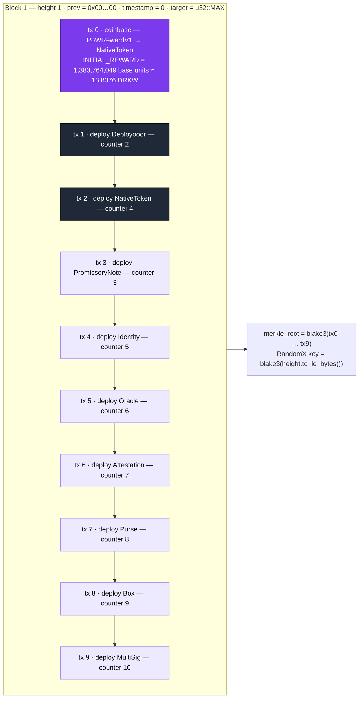

Note the deployment order is **not** counter order: NativeToken (counter 4) is deployed at position 2, before PromissoryNote (counter 3). Binding is by table position in `genesis_contracts()`, not by key — the Book explicitly calls the older counter‑sorted listing "a trap". 🦀

### 1.2 Contract registry

| Pos | Counter | Contract | Crate | Consensus‑critical? | Role |
|---:|---:|---|---|:---:|---|
| 1 | 2 | **Deployooor** | `dwow_deployooor_contract` | ✅ | The infrastructure contract that allows all subsequent WASM smart contracts to be deployed and locked immutably on‑chain. |
| 2 | 4 | **NativeToken** | `dwow_native_token_contract` | ✅ | A deliberately "rock‑dumb" contract handling only block rewards (coinbase), transaction fee payments, and the strict Pedersen mass‑balance supply audit. No multi‑token support, governance hooks, or freezing — minimal consensus attack surface. |
| 3 | 3 | **Promissory Note** | `dwow_promissory_note_contract` | — | The privacy‑first DeFi token layer: token creation, minting, private transfers, and atomic swaps for the entire ecosystem. Five Halo2 circuits (`RegisterType_V2`, `Issue_V2`, `Revoke_V2`, `Transfer_V2`, `Redeem_V2`); Poseidon for every hash and Pedersen commitments for value, with cross‑proof value conservation checked in WASM rather than in‑circuit — see [§3.6](#36-promissory-note--the-promise-is-the-commitment). |
| 4 | 5 | **Identity** | `dwow_identity_contract` | — | The authorization layer issuing ZK‑verifiable credentials so users can prove capabilities (e.g. "can vote") without revealing identity. |
| 5 | 6 | **Oracle** | `dwow_oracle_contract` | — | External data feeds using a "push model" to bring off‑chain data on‑chain. |
| 6 | 7 | **Attestation** | `dwow_attestation_contract` | — | A framework for creating and verifying trusted claims and delegations (predicates, delegation, slashing). |
| 7 | 8 | **Purse** | `dwow_purse_contract` | — | A fungible capability container (hidden balances via Pedersen, hidden token types via Poseidon). |
| 8 | 9 | **Box** | `dwow_box_contract` | — | A capability delegator and restrictor (time locks, spending limits, …); consumed on open via nullifier. |
| 9 | 10 | **MultiSig** | `dwow_multisig_contract` | — | Threshold‑based authorization enabling private, zero‑knowledge voting and multi‑party approvals. |

Machine‑readable copy: [`data/genesis_contracts.csv`](../../data/genesis_contracts.csv) · model: [`code/darkwow_research/genesis.py`](../../code/darkwow_research/genesis.py). 🧪

### 1.3 Two strict categories

The nine genesis contracts are strictly divided by their role in network survival. **Consensus‑critical** — if either fails, the chain halts. **Ecosystem infrastructure** — zero role in block validation, fee payment or coinbase; deployed at genesis only so that every later contract can reference one canonical, well‑known `ContractId` (no fragmentation from replica deployments — the Book compares this to ERC‑20 pre‑deploys on Ethereum testnets or the bank module in Cosmos SDK). 📖 🦀

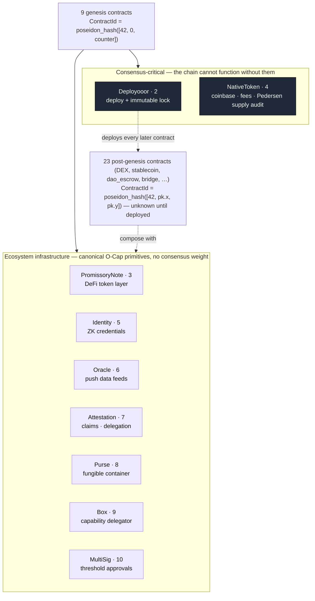

### 1.4 Deterministic `ContractId`s — and why the x‑coordinate is zero

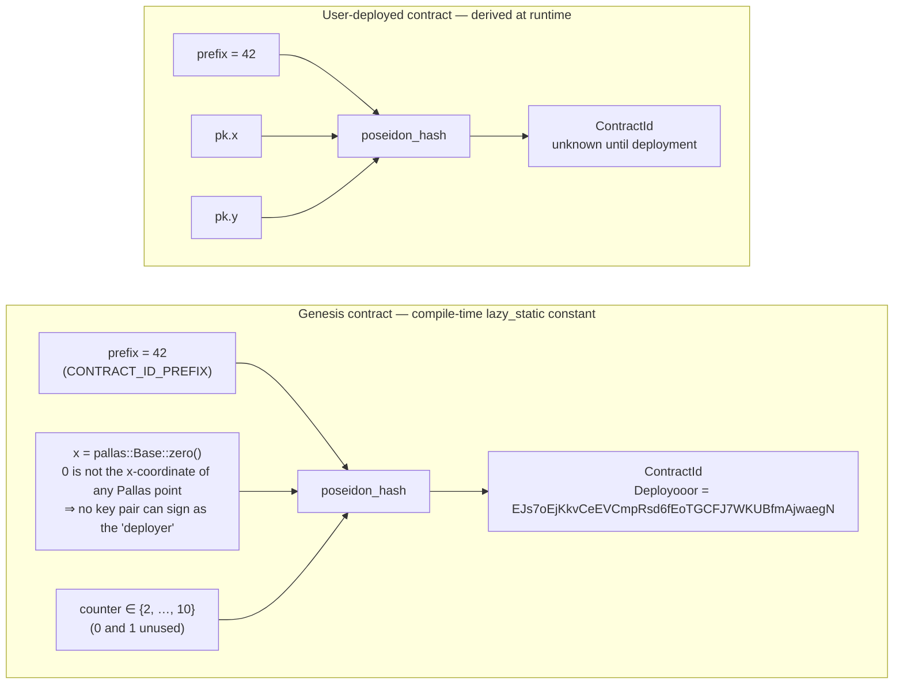

The Rust, verbatim from `src/sdk/src/crypto/contract_id.rs` (abridged): 🦀

```rust
lazy_static! {
    // The idea here is that 0 is not a valid x coordinate for any pallas point,
    // therefore a signature cannot be produced for such IDs. ...
    pub static ref CONTRACT_ID_PREFIX: pallas::Base = pallas::Base::from(42);

    pub static ref DEPLOYOOOR_CONTRACT_ID: ContractId = ContractId::from_base(
        poseidon_hash([*CONTRACT_ID_PREFIX, pallas::Base::zero(), pallas::Base::from(2)]));
    pub static ref PROMISSORY_NOTE_CONTRACT_ID: ContractId = ContractId::from_base(
        poseidon_hash([*CONTRACT_ID_PREFIX, pallas::Base::zero(), pallas::Base::from(3)]));
    pub static ref NATIVE_TOKEN_CONTRACT_ID: ContractId = ContractId::from_base(
        poseidon_hash([*CONTRACT_ID_PREFIX, pallas::Base::zero(), pallas::Base::from(4)]));
    // … Identity 5, Oracle 6, Attestation 7, Purse 8, Box 9, MultiSig 10

    /// Consensus-critical native contract IDs (Deployooor + NativeToken only).
    /// Promissory Note is deliberately excluded — it is ecosystem infrastructure,
    /// not a consensus dependency.
    pub static ref NATIVE_CONTRACT_IDS_BYTES: [[u8; 32]; 2] =
        [DEPLOYOOOR_CONTRACT_ID.to_bytes(), NATIVE_TOKEN_CONTRACT_ID.to_bytes()];
}

impl ContractId {
    /// Derives a `ContractId` from a `SecretKey` (deploy key)
    pub fn derive(deploy_key: SecretKey) -> Self {
        let public_key = PublicKey::from_secret(deploy_key);
        let (x, y) = public_key.xy().expect("pk not identity");
        Self(poseidon_hash([*CONTRACT_ID_PREFIX, x, y]))
    }
}
```

Two consequences worth spelling out:

* **Un‑forgeable ownership.** A user contract's ID commits to a real public key `(x, y)`, so its deployer can sign. Genesis IDs commit to `x = 0`, which no curve point has — therefore *nobody* can ever present a signature claiming to be the deployer of a genesis contract. Immutability is arithmetic, not policy.
* **Zero wallet configuration.** Because the IDs are compile‑time constants, any contract can hard‑reference `PURSE_CONTRACT_ID` or `MULTISIG_CONTRACT_ID` and every node agrees from block 1. 📖

### 1.5 Bootstrap sequence

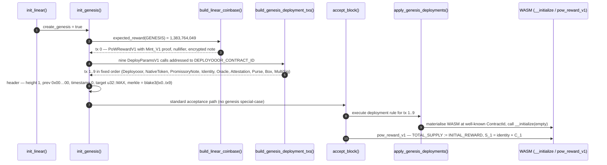

Deployooor and NativeToken carry **empty** manifests; the seven ecosystem contracts carry their `manifest.toml`, stored under `_manifest`‑suffixed keys so wallets can auto‑configure from on‑chain interface declarations. 📖

### 1.6 Genesis header

| Field | Value | Why |
|---|---|---|
| `height` | `1` | `BlockHeight::GENESIS`; height 0 means "no block" and `expected_reward(0) = 0` |
| `previous` | `[0u8; 32]` | No parent |
| `timestamp` | `0` | Deterministic — identical genesis on every node |
| `target` | `u32::MAX` | Any RandomX hash satisfies it; the chain "begins when the first miner finds a block" |
| transactions | 10 | 1 coinbase + 9 deployments |
| `merkle_root` | `blake3(tx0 … tx9)` | |
| coinbase value | `INITIAL_REWARD` (full) | No zero‑reward bootstrap; S₁ = identity + C₁ |

---

## 2. Rationale and differences from DarkFi

Patrick's design of the DarkWow genesis block represents a radical departure from DarkFi. The architecture was specifically chosen to strip away systemic centralization, plutocracy, and points of failure found in DarkFi and other traditional crypto networks.

### 2.1 Side‑by‑side

| Dimension | DarkFi (upstream, as characterised by DarkWow docs) | DarkWow (`linear-master`) | Checked |
|---|---|---|---|
| Governance | Single monolithic DAO contract; ACL‑based, token‑weighted voting | No DAO contract at genesis; six composable O‑Cap primitives (Identity, Oracle, Attestation, Purse, Box, MultiSig) | 📖 🦀 |
| Token architecture | One `Money` contract for consensus **and** DeFi | `NativeToken` (consensus) ⟂ `PromissoryNote` (DeFi) | 📖 🦀 |
| Initial distribution | Pre‑allocations for contributors, investors, SAFT participants | **Zero premine** — every DRKW is mined; block 1 pays the ordinary `INITIAL_REWARD` to whoever mines it | 📖 🦀 |
| Emission | — | Continuous exponential decay, 4‑year half‑life, perpetual 1 %/yr tail; 21 M is a *reference*, not a cap | 🦀 🧪 |
| Consensus | Overlay‑DAG; speculative execution, rollbacks, diffs (`src/validator/`, now deleted) | **Uncle Merkle**: linear, forward‑only, RandomX PoW; competing blocks pinned as uncles and paid | 📖 🦀 |
| Authorization | ACLs — matching a public key to a whitelist reveals the actor | Pure ZK predicates — prove the condition, never the key | 📖 |
| Supply audit | — | Per‑block Pedersen mass balance + cumulative supply commitment chain `S_H = S_{H−1} + C_H` | 📖 🦀 |

### 2.2 Decomposition of the monolithic DAO into O‑Cap primitives

* **DarkFi:** relies on a single, monolithic DAO contract using an ACL‑based (Access Control List), token‑weighted voting model.
* **DarkWow:** rejects the monolithic DAO entirely. Instead, the genesis block deploys six composable Object‑Capability (O‑Cap) primitives. Users and developers build their own modular governance structures by composing these Lego‑like bricks. This prevents whale capture because *"there is no governance token to capture because there is no single governance surface."*

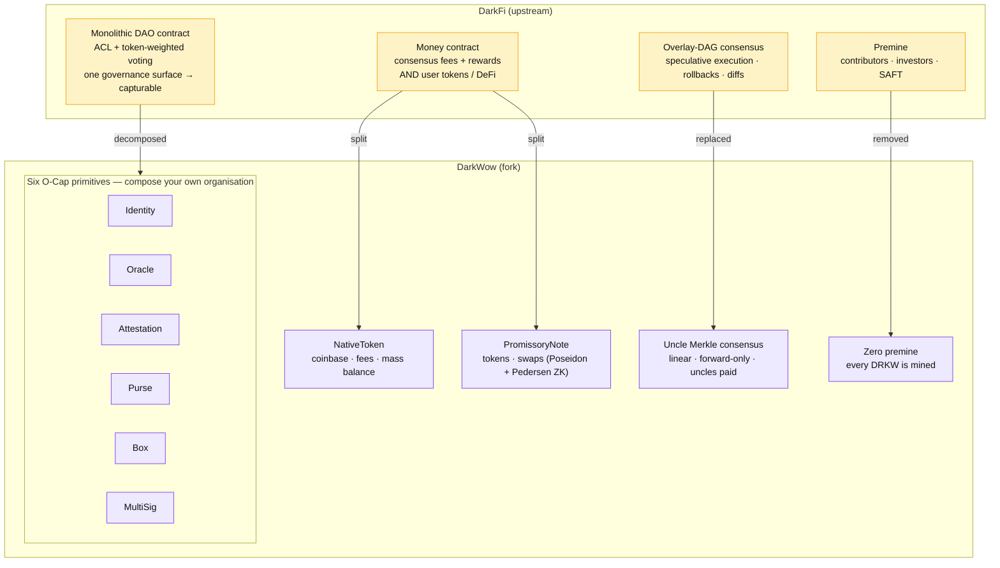

A concrete composition (from the Book's `dao_escrow` case study): a treasury is a **Purse**; spending authority is a **MultiSig** approval capability; that capability is handed over inside a **Box** with a time lock; eligibility to sit on the MultiSig is an **Identity** credential attested by **Attestation**; and a payout condition can be gated on an **Oracle** feed. None of these pieces knows it is "the DAO" — so there is nothing to capture.

### 2.3 The "Money split" (token architecture)

* **DarkFi:** uses a single, massive `Money` contract handling both the consensus layer (fees/rewards) and DeFi operations (user tokens).
* **DarkWow:** splits this into `NativeToken` (consensus) and `PromissoryNote` (DeFi). This isolates the blast radius — a bug in a DeFi token contract cannot halt block production or fee processing.

The Book's phrasing of the design rule: *"Tokens are pipework, not reactors."* NativeToken exposes only what consensus needs (`PoWRewardV1 = 0x05`, `FeeCollectV1 = 0x06`, fee commitments); PromissoryNote carries the DeFi surface (`RegisterTypeV1 0x00`, `RedeemV1 0x01`, `IssueV1 0x02`, `RevokeV1 0x03`, `TransferV1 0x04`, `OtcSwapV1 0x05` — `src/contract/promissory_note/src/lib.rs`; several Book chapters still print the older `TokenMintV1 / MintV1 / BurnV1` names, see Finding 13). Its circuits use Poseidon for every hash and Pedersen commitments for value, and keep the *cross‑proof* work — summing input and output commitments per token type — out of the circuit entirely, in the WASM verification layer ([§3.6](#36-promissory-note--the-promise-is-the-commitment)). That split, rather than a "Poseidon‑only" circuit, is how the fork sidesteps the EC‑heap bugs that killed upstream's `money_v2`. 📖 🦀

### 2.4 Zero premine vs insider allocation — and the emission that replaces it

* **DarkFi:** launched with pre‑allocations for early contributors, investors, and SAFT participants.
* **DarkWow:** implements a strict zero‑premine policy. Every single DRKW token in circulation is mined through Proof of Work. Patrick structured the genesis block to initiate a Satoshi‑style **continuous exponential decay** emission. The chain begins when the first miner finds a block, ensuring a completely fair launch.

There is no allocation table to audit because there is no allocation. What *can* be audited is the emission function, and it is small enough to read in full. 🦀

```rust
// src/sdk/src/blockchain.rs (linear-master), abridged
pub mod reward {
    pub const INITIAL_REWARD: BlockReward = BlockReward(1_383_764_049); // ⌊2.1e15·ln2 / 1_051_920⌋
    pub const HALF_LIFE_BLOCKS: u64 = 1_051_920;                       // ~4 years at 120 s
    pub const TAIL_REWARD: BlockReward = BlockReward(79_853_981);       // ⌊21e6·0.01·1e8 / 262_980⌋
    pub const BLOCKS_PER_YEAR: u64 = 262_980;
}

pub fn expected_reward(height: BlockHeight) -> BlockReward {
    let height = height.get();
    if height == 0 { return BlockReward::ZERO; }
    if height == 1 { return reward::INITIAL_REWARD; }
    let decay = fixed_pow_decay(height - 1);                 // ≈ 2^(-(h-1)/H) in Q32
    let reward = reward::INITIAL_REWARD.mul_fixed_point(decay);
    if reward <= reward::TAIL_REWARD.0 { return reward::TAIL_REWARD; }
    BlockReward(reward)
}

/// DECAY_FP = floor(2^(-1/H) * 2^32); O(log h) binary exponentiation, u128 intermediates.
fn fixed_pow_decay(mut exp: u64) -> u64 {
    const DECAY_FP: u64 = 4_294_964_465;
    let mut result: u64 = 1 << 32;
    let mut base: u64 = DECAY_FP;
    while exp > 0 {
        if exp & 1 == 1 { result = ((result as u128 * base as u128) >> 32) as u64; }
        base = ((base as u128 * base as u128) >> 32) as u64;
        exp >>= 1;
    }
    result
}
```

Integer‑only on purpose: floating point is forbidden for supply computation so that every CPU produces the same coinbase. The Python port in [`code/darkwow_research/emission.py`](../../code/darkwow_research/emission.py) reproduces it bit‑for‑bit and passes the same unit tests as the Rust (`reward_formula_key_points`, `reward_monotonic_decrease`, `binary_exp_additive_property`). 🧪


*Continuous decay against a Bitcoin‑style step schedule with the same R₀ and half‑life. There are no cliff events for miners to game, and the curve never reaches zero: at height 4,327,299 (≈ 16.45 years) it meets the tail floor and stays there forever.*

| Milestone | Height | Block reward (DRKW) | Total supply (DRKW) | Annual inflation |
|---|---:|---:|---:|---:|
| genesis | 1 | 13.837640 | 13.84 | — |
| 1 yr | 262,980 | 11.635355 | 3,341,082 | 91.58 % |
| 2 yr | 525,960 | 9.783561 | 6,150,424 | 41.83 % |
| 4 yr (1 half‑life) | 1,051,920 | 6.917220 | 10,498,925 | 17.33 % |
| 8 yr | 2,103,840 | 3.457808 | 15,747,171 | 5.78 % |
| 12 yr | 3,155,760 | 1.728503 | 18,370,685 | 2.47 % |
| 16 yr | 4,207,680 | 0.864051 | 19,682,138 | 1.15 % |
| **tail onset** (≈16.45 yr) | 4,327,299 | 0.798540 | 19,781,525 | 1.06 % |
| 20 yr | 5,259,600 | 0.798540 | 20,526,004 | 1.02 % |
| 50 yr | 13,149,000 | 0.798540 | 26,826,004 | 0.78 % |
| 100 yr | 26,298,000 | 0.798540 | 37,326,004 | 0.56 % |
| 200 yr | 52,596,000 | 0.798540 | 58,326,004 | 0.36 % |

*Exact integer sums — [`data/emission_milestones.csv`](../../data/emission_milestones.csv). Inflation is forward‑looking (one year of emission at that height ÷ supply).* 🧪


The genesis block is therefore not "the block that allocates" but merely block 1 of the same function every later block follows: `S₁ = identity + C₁`, `total_supply = INITIAL_REWARD`, and from height 2 onward the WASM `pow_reward_v1` enforces `S_H = S_{H−1} + C_H` against `expected_reward(H)`. 📖

### 2.5 Consensus: Uncle Merkle vs Overlay‑DAG

* **DarkFi:** uses a highly complex Overlay‑DAG architecture requiring speculative execution, rollbacks, and diffs to resolve forks.
* **DarkWow:** fully replaced the DAG with **Uncle Merkle** consensus. It is a deterministic, forward‑only, linear blockchain. Competing blocks are not orphaned or subjected to complex DAO adjudication; they are included as "uncles" and share in the PoW reward, making the network Pareto‑efficient and eliminating wasted mining energy.

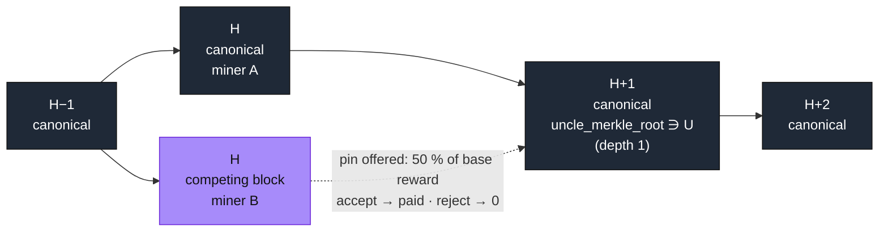

**The pin mechanism (use‑it‑or‑lose‑it).** The canonical chain is *obligated* to offer every valid uncle a pin worth `base_reward / 2^depth` — 50 % at depth 1, halving each level, capped at `MAX_UNCLE_DEPTH = 6`. The uncle miner has a one‑shot accept/reject; accepting pays > 0, rejecting pays 0, so acceptance is strictly dominant. Because the split is **subtractive** — the pins come out of the canonical miner's coinbase — nothing extra is minted. 📖 🦀


```rust
// src/linear/src/supply_chain.rs — value-level split (verbatim from the Book)
fn compute_reward(base_reward: BlockReward, uncles: &[UncleBlock]) -> (BlockReward, Vec<u64>) {
    let base = base_reward.get();
    if uncles.is_empty() { return (base_reward, vec![]); }
    let mut uncle_rewards = Vec::with_capacity(uncles.len());
    for uncle in uncles {
        let pin = if uncle.pin_accepted { uncle.pin_confirmed.get() } else { 0 };
        uncle_rewards.push(pin);
    }
    let total_pin_confirmed: u64 = uncle_rewards.iter().sum();
    let canonical_reward = base.checked_sub(total_pin_confirmed).unwrap_or(0);
    (BlockReward::new(canonical_reward), uncle_rewards)
}
```

The same invariant, one level down, as Pedersen arithmetic — verified by additive homomorphism with **no extra ZK circuit**:

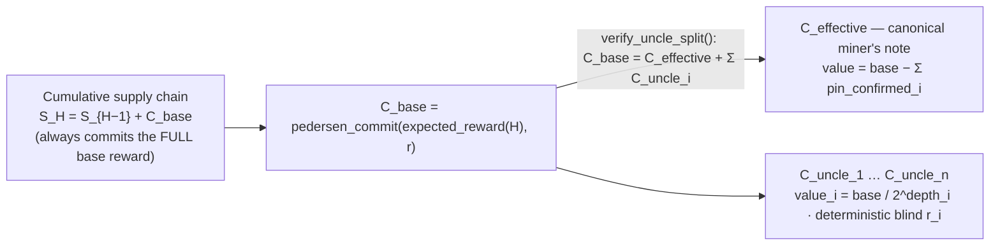

Why this beats the DAG: there is nothing to speculatively execute and nothing to roll back. A competing block either gets pinned (and its transactions absorbed) or it doesn't; state is a pure function of the linear chain, which is also what makes DarkWow's wallet deterministic (*"same keys + same chain = identical wallet state"*). 📖

### 2.6 Privacy and authorization models

* **DarkFi:** relies heavily on ACLs, which inherently reveal the identity of the actor (e.g. matching a public key to a whitelist).
* **DarkWow:** uses pure ZK predicates. A user proves they meet a condition (e.g. they own a credential allowing them to spend treasury funds) via a zero‑knowledge proof, without ever revealing their public key or identity.

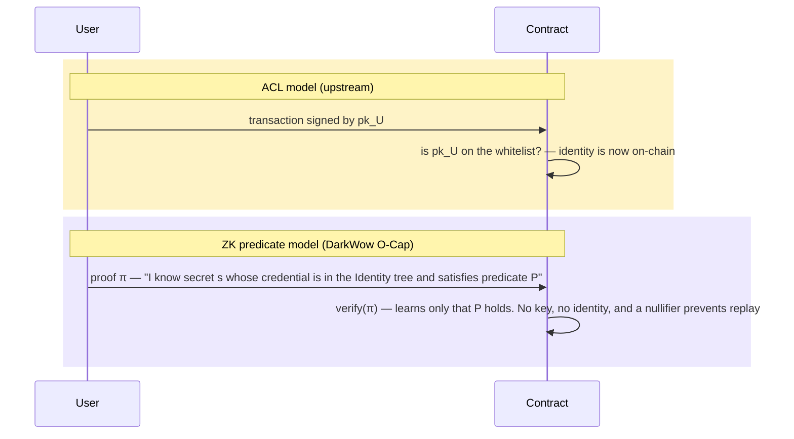

In O‑Cap terms the *secret is the capability*: knowing it **is** the authority, so there is no list to consult and nothing to leak. 📖

---

## 3. Box, Purse and Promissory Note under zero knowledge

Three of the nine genesis contracts are **L1** in the Book's vocabulary: the resource being acted on is named only inside the ZK witness, its existence is proven by Merkle inclusion, and every state change is *consume + create* with a nullifier. They are Promissory Note (counter 3), Purse (8) and Box (9). The other four O‑Cap primitives (Identity, Oracle, Attestation, MultiSig) are **L2** — the record's ID is a public input and the contract does a plain key‑value lookup (*"L1 for transferable o‑caps, L2 for static records"*). 📖 (privacy.md §2, PDF pp. 190–191 and 195–197)

This section reads the three L1 contracts' circuits (`proof/*.zk`), wire structs (`src/model/mod.rs`), entrypoints and manifests against the Book's chapters (Box pp. 992–994, Purse pp. 988–990, Promissory Note pp. 918–963) and asks one question of each: *what is unique about it, and what makes it hard to do in zero knowledge?* Counts and byte layouts quoted below are re‑derived by [`code/darkwow_research/l1_circuits.py`](../../code/darkwow_research/l1_circuits.py) and asserted in [`code/tests/test_l1_circuits.py`](../../code/tests/test_l1_circuits.py); machine‑readable copies are [`data/l1_circuit_inventory.csv`](../../data/l1_circuit_inventory.csv) and [`data/l1_wire_formats.csv`](../../data/l1_wire_formats.csv). 🧪

### 3.1 The L1 pattern: consume + create, and why the circuit cannot look anything up

In L2 a Box or a Purse was a persistent record — you could `Put` into the same `box_id` forever. In L1 there is no object: *"it's a chain of state transitions linked by a resource ID in the ZK witness … An observer sees only nullifiers and Merkle roots — not which box, not by whom, not what's inside."* 📖 (p. 195)

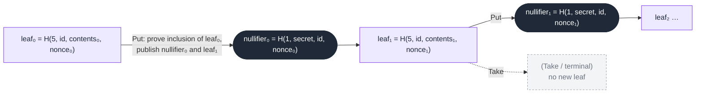

What this costs in ZK terms — the four‑component flow the Book insists every L1 operation follows (pp. 993, 196):

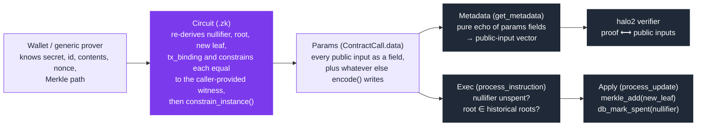

Three consequences make L1 harder than it looks:

1. **The circuit cannot read chain state.** Every public input is a *caller‑provided witness*: the circuit computes the value, `constrain_equal_base`s it against the witness, then `constrain_instance`s the witness. If the caller's precomputation disagrees with the circuit by one domain constant, the proof fails — this is the class of bug the Book's hazard register calls *metadata‑circuit drift* (hazard 22: "Box/Purse fixed", p. 832), and the reason the standards insist that `metadata[i] == proof_instance[i]` position for position (p. 14). 📖 🦀
2. **The contract's WASM never sees a secret.** The *only* thing linking two operations on the same object is the leaf in the Merkle tree. Whatever the leaf does not commit to, the chain cannot enforce — §3.5 turns on this.
3. **Exec and Apply are split.** Exec may read state and must reject; Apply may write and must not validate (*"Exec SHALL NOT write state. Apply SHALL NOT validate"*, p. 14). The Box `Take` path shows the cost: the current root is read in Exec and carried to Apply inside `TakeUpdate { nullifier, current_root }` because Apply is not allowed to look it up. 📖 🦀

The ten circuits draw on one shared table of Poseidon domain separators (each declares only the ones it needs, as `witness_base(n)` constants), and every one publishes a `tx_binding = H(3, tx_commitment, tx_nonce)` so that a proof cannot be lifted out of one transaction and replayed in another (`tx_commitment` is a Blake3 hash of the calls excluding proofs and signatures and stays a private witness; `tx_nonce` is public randomness — tx-commitment.md, pp. 1249–1253). 🦀 🧪

| Domain | Meaning | Used by |
|---:|---|---|
| 1 | nullifier | Box, Purse, PN |
| 2 | token commitment `H(2, asset_id, blind)` | Purse Balance, PN |
| 3 | transaction binding | all ten circuits |
| 4 | commitment — PN coin, Purse `derived_purse_id` | Purse Balance, PN |
| 5 | Merkle leaf | Box, Purse |
| 6 | user‑data encryption | PN Revoke |
| 7 | signature secret → public key `H(7, secret)` | Purse, PN |

**The Halo2 L1 ceiling.** The Book derives a complexity ceiling from Box and Purse — `P_CEILING = 9` public inputs, `W_CEILING = 13` witness‑only values, `O_CEILING = 3` operations per contract — and declares *"Purse IS the L1 ceiling. Any contract more complex than Purse exceeds safe single‑contract L1 bounds and SHALL use L2 or a sharded architecture."* 📖 (pp. 197, 1491–1492). (The PDF's companion claim that safety *adds* across composition, `T(A∘B) = T(A) + T(B)`, was retracted in the source tree after the snapshot — Finding 16.) Counting the `witness` sections and `constrain_instance` calls in the ten `.zk` files reproduces the Book's five rows exactly — and adds the five it does not print: 🧪

| Circuit | k | witness slots | public inputs | witness‑only | Book says | tier (Book's table) |
|---|--:|--:|--:|--:|---|---|
| Box `Put` | 11 | 14 | 5 | 9 | 5 / 9 ✓ | safe |
| Box `Take` | 11 | 11 | 4 | 7 | 4 / 7 ✓ | safe |
| Purse `Deposit` | 11 | 22 | **9** | **13** | 9 / 13 ✓ *(ceiling)* | safe |
| Purse `Withdraw` | 11 | 22 | **9** | **13** | 9 / 13 ✓ *(ceiling)* | safe |
| Purse `Balance` | 11 | 18 | 7 | 11 | 7 / 11 ✓ | safe |
| PN `RegisterType_V2` | 11 | 13 | 8 | 5 | — | safe |
| PN `Issue_V2` | 11 | 14 | 9 | 5 | — | safe |
| PN `Revoke_V2` | 11 | 15 | **10** | 5 | — | **scrutiny** (P > 9) |
| PN `Transfer_V2` | 11 | 11 | 7 | 4 | — | safe |
| PN `Redeem_V2` | 11 | 11 | 8 | 3 | — | safe |

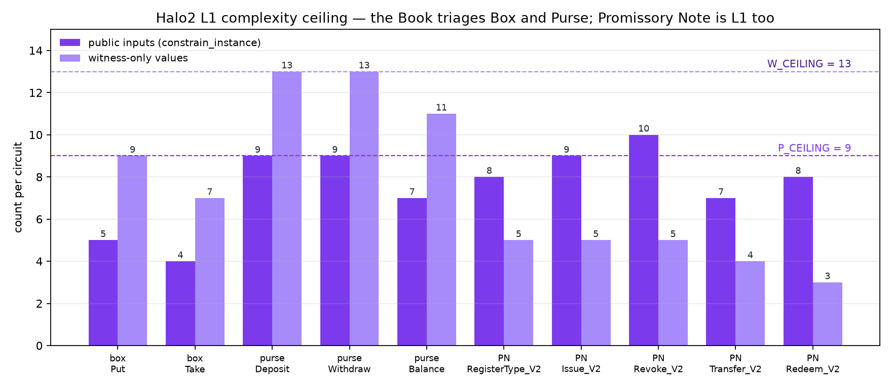

Promissory Note is L1 by the Book's own definition, exposes five circuits (`O_CEILING` is three) and its spend circuit has ten public inputs — so by the table it is "scrutiny", not "safe", and it is the one L1 contract the triage never classifies (Finding 15). The witness‑only column also shows *why* Purse is the ceiling: it is not the logic, it is the depth‑32 Merkle path (`MerklePath = [MerkleNode; 32]`, Orchard's depth, 1,024 bytes) plus three Pedersen commitments, each with its own blind, and three 64‑bit range checks. 🦀

### 3.2 Box — the linear delegation container

Box is *"the capability to delegate — the ZK‑native equivalent of Agoric's Invitation."* 📖 (p. 992). Mechanically it is the smallest possible L1 object: two circuits, no elliptic‑curve work, four Poseidon hashes.

```text
# src/contract/box/proof/put.zk (abridged; k = 11, field = "pallas")
nullifier_circuit = poseidon_hash(DOMAIN_NULLIFIER, owner_secret, box_id, old_state_nonce);
constrain_equal_base(nullifier_circuit, nullifier);           constrain_instance(nullifier);

old_leaf = poseidon_hash(DOMAIN_MERKLE_LEAF, box_id, old_contents_commit, old_state_nonce);
root = merkle_root(leaf_pos, path, old_leaf);
constrain_equal_base(root, expected_root);                    constrain_instance(expected_root);

new_leaf_circuit = poseidon_hash(DOMAIN_MERKLE_LEAF, box_id, new_contents_commit, new_state_nonce);
constrain_equal_base(new_leaf_circuit, new_leaf);             constrain_instance(new_leaf);

tx_binding_circuit = poseidon_hash(DOMAIN_TX_BINDING, tx_commitment, tx_nonce);
constrain_equal_base(tx_binding_circuit, tx_binding);         constrain_instance(tx_binding);
constrain_instance(tx_nonce);
```

`Take` is the same minus the new leaf. Exec checks the nullifier is unspent and that `expected_root` is in `box_roots` (skipped only while the tree is still empty, so the first `Put` can bootstrap); Apply appends the leaf, marks the nullifier and writes a block‑level anchor entry. 🦀

What is unique about Box in a ZK setting:

* **It does not know what it holds.** `contents_commit` is an opaque field element. The Book's summary of Box as a *"capability restrictor — spending limits, time locks, conditions"* (p. 19) describes what whoever *interprets* the commitment can enforce; the Box circuits themselves prove only "a nullifier for this leaf was produced and the leaf was replaced/consumed". §1.2's one‑line description should be read the same way — as what you build with a Box, not what Box enforces. 📖 🦀
* **Delegation is linear by construction.** A `Take` produces no leaf: the capability is gone. A `Put` moves it to a new leaf whose `new_contents_commit` may be a *different* delegate's commitment — that is the hand‑over. 🦀
* **`new_state_nonce` is a free witness.** Put constrains nothing about the relation between `old_state_nonce` and `new_state_nonce`; Purse, by contrast, derives `new_nonce = state_nonce + 1` in‑circuit (Finding 12). 🦀
* **There is no `owner_pub`.** The Book's barb table and the crate README both list `↓spend: owner_pub == poseidon_hash(DOMAIN_SIGNATURE_SECRET, owner_secret)` for Put; neither circuit contains that hash, and the Book's leaf formula uses `DOMAIN_SIGNATURE_SECRET` where the code uses `DOMAIN_MERKLE_LEAF = 5` (Finding 10). 📖 🦀
* **There is no client.** `BoxClient` was removed on 2026‑07‑15; the only way to build a Box proof is the wallet's generic prover driven by the manifest's `witness_map` (`"param:box_id"`, `"secret"`, `"merkle_path"`, `"derived:nullifier:8,0,1"`, …). Box is the purest example of the wallet's rule that non‑native operations route *"`invoke_contract` → manifest → prover — ONE path, zero per‑contract code"* (wallet.md §6.4.1). 🦀

### 3.3 Purse — a balance that exists twice

Purse is *"the capability to hold fungible value … The balance amount is hidden in a Pedersen commitment; conservation is proven via additive homomorphism in the circuit."* 📖 (p. 988). The circuit does exactly that — and also something the Book's summary does not say: the balance lives in the leaf **as a plaintext witness**, and the Pedersen commitment is a *second* binding of the same number.

```text
# src/contract/purse/proof/deposit.zk (abridged)
derived_owner = poseidon_hash(DOMAIN_SIGNATURE_SECRET, owner_secret);
constrain_equal_base(derived_owner, owner_pub);                 # owner_pub is a witness, not a public input

nf_circuit = poseidon_hash(DOMAIN_NULLIFIER, owner_secret, purse_id, state_nonce);
constrain_equal_base(nf_circuit, nullifier);                    constrain_instance(nullifier);

old_leaf = poseidon_hash(DOMAIN_MERKLE_LEAF, purse_id, old_balance, state_nonce);   # plaintext balance in the leaf
root = merkle_root(leaf_pos, path, old_leaf);
constrain_equal_base(root, expected_root);                      constrain_instance(expected_root);

old_commit = ec_mul_short(old_balance, VALUE_COMMIT_VALUE) + ec_mul(old_balance_blind, VALUE_COMMIT_RANDOM);
dep_commit = …(deposit_amount, deposit_blind);  new_commit = …(new_balance, new_balance_blind);
constrain_equal_point(ec_add(old_commit, dep_commit), new_commit);                  # homomorphic conservation
constrain_instance(old_commit_x); … constrain_instance(new_commit_y);               # 4 public inputs

computed_new = base_add(old_balance, deposit_amount);
constrain_equal_base(computed_new, new_balance);                                    # integer conservation

new_nonce = base_add(state_nonce, ONE);                                             # nonce increments in-circuit
new_leaf_circuit = poseidon_hash(DOMAIN_MERKLE_LEAF, purse_id, new_balance, new_nonce);
constrain_equal_base(new_leaf_circuit, new_leaf);               constrain_instance(new_leaf);

range_check(64, old_balance); range_check(64, deposit_amount); range_check(64, new_balance);
```

`Withdraw` mirrors it with `base_sub`, `constrain_equal_point(new + wdr, old)` and two bounds: `less_than_strict(0, withdraw_amount)` and `less_than_or_equal(withdraw_amount, old_balance) == 1`. `Balance` is read‑only (no nullifier) and publishes `derived_purse_id = H(4, owner_pub, asset_id, purse_id)`, `balance_commit` and `token_commit = H(2, asset_id, token_blind)`. 🦀

What is unique — and difficult — about Purse:

* **Two representations must agree.** The leaf (`H(5, purse_id, balance, nonce)`) is what the chain tracks; the Pedersen point is what a *composing contract* can add up. The circuit is the only place they meet, which is why Purse burns 10 EC operations and 3 range checks per transition and sits exactly on the ceiling. 🦀 🧪
* **The homomorphism is checked but not consumed by Purse itself.** Exec reads `nullifier`, `expected_root`, `new_leaf`, `tx_binding` and `tx_nonce`; it never looks at `old_commit_*`/`new_commit_*`, and `deposit_commit` is not a public input at all (a parent can recover it as `new − old`). Inside Purse, continuity of value is carried by the *integer* check through the leaf; the Pedersen coordinates exist for a parent. The Purse never learns where `deposit_amount` came from — escrow's `FundV1`, for example, requires a `PN::TransferV1` child beside the `Purse::Deposit` child and checks each child's selector and `ContractId`, but does not relate the two commitments to each other. 🦀
* **Deposit and Withdraw carry no asset.** Only `Balance` computes a `token_commit`; the Book's `↓denominate` barb on Deposit (p. 989) has no counterpart in `deposit.zk` (Finding 10). Which token a purse holds is a convention between the owner and the composing contract. 📖 🦀
* **`Balance` is linkable.** `derived_purse_id` is deterministic in `(owner_pub, asset_id, purse_id)`, so two Balance proofs for the same purse publish the same value — appropriate for a read‑only attestation, but it is the one place an L1 genesis contract publishes a stable per‑object identifier. 🦀
* **Its own header disagrees with its body.** `deposit.zk`/`withdraw.zk` open with *"state_nonce is shared across old_leaf, new_leaf, and nullifier … Multi‑operation chaining (Deposit→Withdraw) requires distinct owner_secret values per operation"*, then increment the nonce in‑circuit thirty lines later (Finding 11). 🦀

### 3.4 What the wire carries: the params-based L1

Promissory Note ships each output with an AEAD‑encrypted note; Box and Purse do not. Their manifests say so in the first lines: *"Purse is params‑based (no AEAD note): witness values travel in the call params, with owner_secret and the Pedersen blinds private (wallet.md §6.4.1)."* 🦀 Reading `PutParams::encode()` and `DepositParams::encode()` (`src/model/mod.rs`) gives the exact byte layout of what every node stores for every Box and Purse operation: 🧪

| `PutParams` (Box) | bytes | on‑chain? | `DepositParams` / `WithdrawParams` (Purse) | bytes | on‑chain? |
|---|--:|:--:|---|--:|:--:|
| `box_id` | 32 | **plaintext** | `purse_id` | 32 | **plaintext** |
| `old_state_nonce` | 32 | **plaintext** | `old_balance` (u64 LE) | 8 | **plaintext** |
| `new_state_nonce` | 32 | **plaintext** | `deposit_amount` / `withdraw_amount` (u64 LE) | 8 | **plaintext** |
| `old_contents_commit` | 32 | **plaintext** | `new_balance` (u64 LE) | 8 | **plaintext** |
| `new_contents_commit` | 32 | **plaintext** | `state_nonce` | 32 | **plaintext** |
| `nullifier` | 32 | public input | `nullifier` | 32 | public input |
| `expected_root` | 32 | public input | `expected_root` | 32 | public input |
| `new_leaf` | 32 | public input | `new_leaf` | 32 | public input |
| `leaf_pos` (u32) | 4 | plaintext | `old_commit_x/y`, `new_commit_x/y` | 128 | public inputs |
| `merkle_path` (32 × 32) | 1,024 | plaintext | `leaf_pos` (u32) | 4 | plaintext |
| `proof` (u8 length + bytes) | 1 + n | vestigial | `merkle_path` (32 × 32) | 1,024 | plaintext |
| `tx_binding`, `tx_nonce` | 64 | public inputs | `proof` (u8 length + bytes) | 1 + n | vestigial |
| | | | `tx_binding`, `tx_nonce` | 64 | public inputs |
| | | | `asset_id` | 32 | **plaintext, unused** |
| **total** | **1,349 + n** | | **total** | **1,437 + n** | |

(`TakeParams` is 1,253 + n, `BalanceParams` 1,357 + n; the `proof` field is a placeholder — real proofs travel in `Transaction.proofs` and the upstream tests fill it with `vec![1, 2, 3]`. The Merkle path is roughly three‑quarters of every payload.) 🦀 🧪

Two things follow. First, the statement that an observer sees *"not which box, not by whom, not what's inside"* (p. 195) does not hold for the current wire format: `box_id`, both nonces and both contents commitments are in every `Put`; the plaintext `old_balance`, amount and `new_balance` are in every Purse transition — which makes the Pedersen commitments beside them decorative for privacy purposes. The `asset_id` field on Deposit/Withdraw is not even a circuit witness — it is carried, decoded and ignored. It also cuts against the Book's *genesis singleton rule* — one Box tree and one Purse tree so that *"an observer knows the contract type but cannot distinguish objects within it"* (p. 191) — because the object is named in the clear beside the proof. Second, the Book's own hardening heuristic classifies this pattern: *"If the value is only needed by the two counterparties to a transfer, it should stay behind a commitment"* (p. 1484). The manifests acknowledge the design (the wallet's `witness_map` binds `"param:box_id"`, `"param:old_balance"` … from the action's `[[parameters]]`), so this is a known trade‑off rather than an oversight — but it is worth being precise that today Box and Purse are *private in the proof* and *public on the wire* (Finding 9). 📖 🦀

### 3.5 Who may consume a leaf? The owner-binding gap

This is the observation the section was written for. Put the Box and Purse formulas next to the Promissory Note's:

| | Box / Purse (L1 leaf) | Promissory Note (coin) |
|---|---|---|
| what the tree holds | `leaf = H(5, id, contents‑or‑balance, nonce)` | `coin = H(4, pub, value, asset_id, spend_hook, user_data, blind)` with `pub = H(7, spend_secret)` |
| what consumes it | `nullifier = H(1, owner_secret, id, nonce)` | `nullifier = H(1, spend_secret, coin)` |
| is the spender's secret pinned by the leaf? | **no** — `owner_secret` appears only in the nullifier | **yes** — the coin commits to `pub`, and the same `spend_secret` must open both |
| distinct valid nullifiers per leaf | one per distinct `owner_secret` — unbounded | exactly one |

In `put.zk`, `take.zk`, `deposit.zk` and `withdraw.zk`, `owner_secret` is used in exactly one constraint: the nullifier. Nothing ties it to the leaf being consumed. (Purse's `derived_owner == owner_pub` line is real, but `owner_pub` is a private witness that is never published or folded into the leaf in Deposit/Withdraw, so it constrains nothing an observer or the contract can see.) Two things then follow from the circuits alone, without touching a node: 🦀 🧪

1. **Consumption authority is knowledge of the leaf preimage, not of a secret.** Anyone who knows `(id, contents‑or‑balance, nonce)` for a leaf in the tree — and can therefore rebuild its Merkle path from the public leaves — can pick any `owner_secret'`, compute a fresh `nullifier'`, and produce a valid `Take`/`Put`/`Withdraw` against it. Exec will accept: `nullifier'` is unspent and the root is historical. And §3.4 shows the preimage of every leaf is published in the params of the call that created it (`box_id`, `new_state_nonce`, `new_contents_commit`; `purse_id`, `new_balance`, and the nonce which the circuit fixes as `state_nonce + 1`).
2. **Linearity is not enforced by the circuit.** The same leaf admits one nullifier per secret, so a holder can consume their own Box or Purse leaf twice with two secrets, obtaining two successor leaves — two copies of a capability that the Book describes as *"exercised exactly once"*, or two purse states each carrying the full balance. Block‑level nullifier de‑duplication (`chain_state.rs`) cannot see this: the nullifiers are genuinely different.

The Book's intended reading is visible in its own text: `box_id` *"binds state transitions in the ZK witness but is never exposed as a public input"* (p. 992) — i.e. the unguessable ID *is* the capability, in good O‑Cap style. Under that reading the params‑based wire format is what breaks it (it publishes the ID); under the READMEs' reading (*"Authority is the `owner_secret` embedded in the nullifier"*) the circuits are what break it (the secret is not bound to anything). Either way `owner_secret` does no authorization work today. Promissory Note shows the fix in‑tree: fold `owner_pub = H(7, owner_secret)` into the leaf, exactly as the coin folds `pub` — one extra Poseidon input, no new public inputs, and the Book's `↓spend` barb becomes true rather than aspirational.

*Caveats.* This is a static reading of the circuits at commit `ec914970`; it has not been exercised against a running node or the heavyweight Purse pipeline test (`test_heavyweight_purse`). Impact depends on what composes the Purse (which contract honours a Withdraw commitment) and on whether any parent independently binds the leaf to an owner — none of the composing contracts read here does. It is recorded as Finding 8 and is the first thing the author would raise upstream.

### 3.6 Promissory Note — the promise is the commitment

The Book opens the chapter with George Selgin's *Good Money*: when the Royal Mint stopped striking copper in the 1780s, Birmingham button‑makers, mines and factories issued their own **Conder tokens** — bearer instruments redeemable at the issuer. *"The token WAS the proof of the promise. Whoever held it held the capability to redeem."* Promissory Note is *"the cryptographic realization of this same principle … A commitment is a promissory note. Holding it is the capability to redeem."* 📖 (p. 918)

The chapter then names three problems it calls *"previously considered intractable"* for private ERC‑20‑style tokens, and the code answers each with a specific mechanism: 📖 🦀

| Intractable problem (p. 918–919) | Mechanism in `promissory_note/` |
|---|---|
| **Authorization without access control** — `onlyOwner` reveals the owner | `Issue_V2` proves `mint_public = H(7, backing_secret)` in‑circuit and publishes it; Exec compares it with the `token_auth_parent` stored at `RegisterTypeV1` for that `asset_id` (*"Without this check, anyone with ANY valid IssueV1 proof can mint ANY registered token"*). The issuer is a *proof of knowledge*, not an address |
| **Value conservation without visible values** | every circuit publishes a Pedersen `value_commit`; the WASM sums input and output points **per `token_commit` group** (`verify_value_conservation`) — no value or token type is ever revealed |
| **Lifecycle closure without linkability** | `Redeem_V2` creates a **zero‑value receipt** coin; the burned coin's nullifier and the receipt share nothing an observer can join |

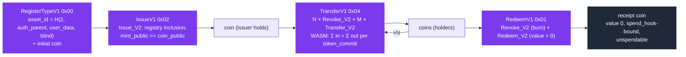

**Function selectors** (`src/lib.rs`): `RegisterTypeV1 = 0x00`, `RedeemV1 = 0x01`, `IssueV1 = 0x02`, `RevokeV1 = 0x03`, `TransferV1 = 0x04`, `OtcSwapV1 = 0x05`. Several Book chapters (and the first draft of §2.3 above) still use the older `TokenMintV1 / MintV1 / BurnV1 / TransferV1 = 0x03 / OtcSwapV1 = 0x04` vocabulary; the PN chapter and the code agree on the new one (Finding 13). 🦀 🧪

**The spend/output split is what makes conservation hard.** A transfer is not one proof. It is N `Revoke_V2` proofs (one per coin spent: nullifier, Merkle root, `value_commit`, `token_commit`, `user_data_enc`, revealed `spend_hook`, a per‑burn `signature_public`, `tx_binding`, `tx_nonce` — ten public inputs) plus M `Transfer_V2` proofs (one per coin created: `coin`, `value_commit`, `token_commit`, `spend_hook`, `tx_binding`, `tx_nonce` — no nullifier, no Merkle proof). No single circuit ever sees both sides, so *"inputs equal outputs"* cannot be a circuit constraint at all. It is a **cross‑proof** property, enforced in WASM on the published points: 🦀

```rust
// src/contract/promissory_note/src/entrypoint/mod.rs (abridged)
fn verify_value_conservation(inputs: &[Input], outputs: &[Output]) -> ContractResult {
    // per-token_commit sums, linear scan (transfer/OTC have ~1-4 entries)
    let mut input_sums:  Vec<(pallas::Base, pallas::Point)> = Vec::new();   // (token_commit, Σ value_commit)
    let mut output_sums: Vec<(pallas::Base, pallas::Point)> = Vec::new();
    …
    // every token_commit present in inputs must have an equal sum in outputs …
    // … and no token_commit may appear only in outputs
}
```

Grouping by `token_commit` is what stops value crossing token types: the same `asset_id` must be blinded identically on both sides of a transfer for the sums to line up, and a different type on the output side is rejected as "not present in inputs". The reason a proof from one transaction cannot be recombined into another to satisfy this check is `tx_binding` — each proof commits to the `tx_commitment` of the transaction it was made for. 🦀 📖 (pp. 1249–1253)

Details that only show up in the circuits:

* **Issuance mints to the authority itself.** `Issue_V2` contains `constrain_equal_base(coin_public, mint_public)` ("RC1‑B"): a freshly issued coin always belongs to the backing‑secret holder, and reaches anyone else only via a `TransferV1`. Issue publishes `asset_id` in the clear (a type‑transparent mint); transfers hide the type behind `token_commit = H(2, asset_id, asset_id_blind)`. 🦀
* **`RegisterType_V2` is permissionless and also mints.** `asset_id = H(2, token_auth_parent, token_user_data, token_blind)` is derived in‑circuit and an initial coin is created in the same proof; the Book lists "no authority check" as a deliberate residual (p. 963) — the security boundary is `IssueV1`. 📖 🦀
* **Spending is guarded twice.** `Revoke_V2` requires `less_than_strict(0, value)` and runs the Merkle proof through `zero_cond(value, coin)` (RC2) — so a zero‑value coin is *structurally* unspendable. That is what makes the Redeem receipt final: `Redeem_V2` exposes `value` as a public input **and** pins it with `constrain_equal_base(value, ZERO)` ("HAZOP ELEV‑4 FIX"). The Book's introduction credits the `is_notequal` gate as the breakthrough (p. 919); the shipped circuit uses plain equality, and the Book's own layout section calls the two *"functionally equivalent"* (p. 931). 🦀 📖
* **Redemption is value destruction.** `redeem_v1` checks root, nullifier and receipt uniqueness and *"Value conservation is deliberately NOT enforced here"* — the promise is fulfilled off‑chain by the issuer releasing the underlying asset. 🦀
* **"Signing" is a proof of knowledge.** Every Revoke derives `signature_secret = H(7, spend_secret, nullifier)` and publishes `signature_public = H(7, signature_secret)`; the metadata's Schnorr `signature_pubkeys` is `vec![]` by standard (*"Schnorr signatures are PROHIBITED in contract metadata"*, contract‑standards §3, p. 892). Note the standard's rationale sentence — *"Every ZK circuit proves secret key knowledge via `ec_mul_base(secret, NULLIFIER_K)`"* — describes the upstream design; the L1 circuits use `poseidon_hash(7, secret)` (Finding 14). 🦀 📖
* **What PN refuses to do.** No supply cap, no collateral, no oracle, no mandatory redemption, no supply tracking — *"PN deliberately omits logic that belongs in the issuer contract"*, and the Book ships two reference issuers at opposite ends of the trust spectrum, Bridge (cryptographic self‑custody) and Stablecoin (p. 921). The Money split's ordering — *"CONSENSUS FIRST, FEES SECOND, PRIVACY THIRD"* (p. 939) — is why the DeFi token can afford this: nothing here can halt a block. 📖
* **A residual risk that has since closed.** The Book lists *"Same‑block double‑spend"* as residual (p. 963). `chain_state.rs` now rejects a block in which a spend nullifier is already spent *or repeats within the block* (`"duplicate spend nullifier (double-spend)"`), and `Transaction.nullifiers` feeds mempool de‑duplication — assuming the reconciliation of `tx.nullifiers` against the proofs' public inputs (standards §9.3) holds, which this note did not trace (Finding 17). 🦀

### 3.7 Summary — what is unique, what is hard, where it is solved

| | Box | Purse | Promissory Note |
|---|---|---|---|
| Object | opaque `contents_commit` + nonce | plaintext balance in leaf **and** Pedersen point | coin `H(4, pub, value, asset_id, hook, data, blind)` |
| Consume + create | Put creates, Take terminal | Deposit/Withdraw create, Balance read‑only | Revoke consumes, Transfer/Issue/RegisterType/Redeem create |
| In‑circuit crypto | Poseidon only | Poseidon + 10 EC ops + 3 range checks | Poseidon + Pedersen (3 EC ops) per proof |
| Conservation | none (Box holds one thing) | in‑circuit `base_add` + homomorphism, unused by Exec | **cross‑proof**, in WASM, per `token_commit` |
| Hidden on the wire | nullifier, root, leaf — but `box_id`, nonces, contents in params | same — plus balances as u64 | everything except nullifiers, roots, points and hooks; recipient data in an AEAD note |
| Owner pinned by the leaf | **no** | **no** | yes |
| Book vs code | `↓spend` barb, leaf domain constant, no client | `↓denominate` on Deposit, `purses` tree, header comment | selector names in other chapters, `is_notequal` narrative, residual risk list |

---

## 4. The philosophical core

The design of the DarkWow genesis block is rooted in a specific philosophical divergence from DarkFi, which the documentation frames through two trajectories out of Warwick's CCRU: Nick Land's reading of Bitcoin as **chronogenesis in the service of Capital**, and Mark Fisher's left‑accelerationist reading in which the same time‑producing machinery can be turned to other ends. Fisher's *Capitalist Realism* names the belief that there is no alternative to extractive financialisation — and, the Book argues, premines, VC SAFTs and governance‑DAO plutocracy are exactly that belief compiled into smart contracts. *"DarkFi is the Land fork. DarkWow is the Fisher fork. Same technical base … opposite conclusion about what the time being produced is for."* 📖

Patrick designed the genesis block to **remove the affordances for extraction**. By refusing to include a premine and by destroying the monolithic DAO in favour of O‑Cap primitives, DarkWow structurally prevents the plutocratic takeover of the network. The genesis block is built to serve the ecosystem as neutral, thermodynamic infrastructure, ensuring that the "chronogenic time" produced by the blockchain is used for coordination and building rather than pure financial accumulation by early insiders.

Read against block 1, each philosophical claim has a mechanical shadow:

| Claim | Mechanism in block 1 |
|---|---|
| "No affordance for extraction" | Coinbase pays `expected_reward(1)` to an unknown miner; there is no allocation transaction type at all |
| "No single governance surface" | Six primitives with independent `ContractId`s; no contract named "DAO" in genesis |
| "Neutral infrastructure" | Genesis IDs commit to `x = 0` → no deployer, no owner, no admin key |
| "Thermodynamic" | Target `u32::MAX` at height 1: the chain starts the moment work is done, not when a foundation says so |

---

## 5. Findings, discrepancies and open questions

Things that surfaced while re‑deriving the numbers. None are bugs in the sense of "wrong coins get minted" — consensus is whatever the integer code says — but they matter when quoting the spec.

1. **Spec prose vs code exponent.** The Book's §4.2 writes `R(h) = max(R₀ × 2^(−h/H), R_tail)`, while the implementation (and its doc‑comment) uses `2^(−(h−1)/H)` so that `R(1) = R₀` exactly. Off by one block — harmless, but the prose formula under‑states every reward by a factor `2^(−1/H)`. 🦀 🧪
2. **Fixed‑point drift is systematic, not random.** `DECAY_FP = ⌊2^(−1/H)·2³²⌋` is rounded *down*, so consensus rewards sit slightly *below* the real‑valued curve and the gap grows linearly: −232 ppm at one half‑life (6.917216 vs 6.918820 DRKW), ≈ −950 ppm at tail onset. Net effect: the tail floor is reached at height **4,327,299**, about 1,450 blocks (~2 days) earlier than the ideal formula predicts. The Rust test tolerance (1 % at half‑life) comfortably absorbs this. 🧪

   

3. **The Book's §4.5 supply table is ~0.5 M DRKW high.** It lists ~21.0 M at 20 years and ~27.3 M at 50 years. The exact integer sum gives **20.53 M** and **26.83 M**: the exponential phase only ever emits ≈ 19.78 M because the tail floor truncates the last ≈ 1.2 M of the geometric series; 21 M is crossed around **year 22.3**, not year 20. The table appears to assume the exponential phase delivers the full 21 M reference before the tail begins. 🧪
4. **Uncle rewards are value‑level only today.** The Book's own status note says the reduced canonical note + per‑uncle spendable notes are the *target* design; the current code still mints the full base reward into the coinbase note and tracks uncle commitments in memory, so uncle pins are computed and verified but **not yet spendable**. Worth tracking as the "Pareto‑efficient" claim depends on it. 📖
5. **Deployment order ≠ counter order.** Position 2 is NativeToken (counter 4), position 3 is PromissoryNote (counter 3). Anyone indexing genesis by counter will mis‑bind two contracts. 🦀
6. **Open — DarkFi side of the comparison.** The upstream characterisations (overlay‑DAG, `Money` monolith, token‑weighted DAO, SAFT allocations) are taken from DarkWow's *Differences from Upstream* page and have not been independently checked against `darkrenaissance/darkfi` at the fork point.
7. **Open — poseidon IDs.** The base58 IDs for the eight non‑Deployooor genesis contracts are not printed in the source comments; regenerating all nine with the Rust crate (and pinning them in `data/`) is a cheap follow‑up.

Findings 8–17 come from the [§3](#3-box-purse-and-promissory-note-under-zero-knowledge) reading of the Box, Purse and Promissory Note circuits at commit `ec914970`. Unlike 1–7 they are not about numbers; 8 and 9 are about soundness and privacy, and are stated as static readings of the circuits that have not been exercised against a node.

8. **Box/Purse leaves do not pin their owner.** In `put.zk`, `take.zk`, `deposit.zk` and `withdraw.zk` the leaf is `H(5, id, contents‑or‑balance, nonce)` and `owner_secret` appears only in the nullifier `H(1, owner_secret, id, nonce)`. Nothing constrains the secret against the leaf, so (a) anyone who knows a leaf's preimage can consume it with a secret of their choosing, and (b) a single leaf admits one valid nullifier per distinct secret, so the "exercised exactly once" property of a Box, and the single‑successor property of a Purse balance, are not circuit‑enforced; block‑level nullifier de‑duplication cannot detect it because the nullifiers differ. The Promissory Note coin, `H(4, pub, value, …)` with `pub = H(7, spend_secret)`, does not have this gap; folding `owner_pub` into the Box/Purse leaf (one extra Poseidon input) would close it. Details in [§3.5](#35-who-may-consume-a-leaf-the-owner-binding-gap). 🦀 🧪
9. **The params‑based wire format publishes the L1 witness.** `PutParams` carries `box_id`, both nonces and both contents commitments in plaintext; `DepositParams`/`WithdrawParams` carry `purse_id`, `old_balance`, the amount and `new_balance` as little‑endian `u64`s beside the Pedersen commitments of the same values, plus an `asset_id` that no circuit reads. This is the design the manifests describe ("params‑based, no AEAD note"), but it contradicts the Book's "not which box, not by whom, not what's inside" (p. 195) and its own "keep counterparty‑only values behind a commitment" heuristic (p. 1484), and it is what makes Finding 8 practical (the leaf preimage is public). Byte tables in [§3.4](#34-what-the-wire-carries-the-params-based-l1) and [`data/l1_wire_formats.csv`](../../data/l1_wire_formats.csv). 🦀 🧪
10. **Book barb tables vs the shipped circuits (Box/Purse).** The Box chapter (pp. 992–993) and `box/README.md` list a `↓spend: owner_pub == H(DOMAIN_SIGNATURE_SECRET, owner_secret)` barb on Put that no Box circuit contains, and write the leaf with `DOMAIN_SIGNATURE_SECRET` where the code uses `DOMAIN_MERKLE_LEAF = 5`. The Purse chapter (pp. 988–990) lists a `↓denominate` barb on Deposit that `deposit.zk` does not compute (only `Balance` derives a `token_commit`) and a `purses` state tree the contract does not create (its trees are `nullifiers`, `info`, `purse_roots`). 📖 🦀
11. **`deposit.zk`/`withdraw.zk` header comments contradict their bodies.** Both open by stating that the nonce is shared between old leaf, new leaf and nullifier, so that chaining Deposit → Withdraw "requires distinct `owner_secret` values per operation" (the harness quoted as `os = 43` vs `42`); both then compute `new_nonce = state_nonce + 1` in‑circuit. `verification‑hazop.md` OBL‑C87 (2026‑09‑23) shows the harness now chains with a single secret, so the comment is stale. 🦀
12. **Box `Put` leaves `new_state_nonce` unconstrained.** Purse derives the successor nonce in‑circuit; Box takes it as a free witness. A Put that re‑uses the nonce it just consumed would create a successor leaf whose nullifier under the same secret is already marked spent — a footgun rather than an exploit, but an unnecessary degree of freedom given Finding 8. 🦀
13. **Promissory Note selector names are inconsistent across the Book.** `src/lib.rs` and the PN chapter (pp. 959, 962) use `RegisterTypeV1 0x00 · RedeemV1 0x01 · IssueV1 0x02 · RevokeV1 0x03 · TransferV1 0x04 · OtcSwapV1 0x05`; the overview, invoke‑API, stablecoin and quantum‑OS pages (pp. 32, 131, 321, 732, 1006, …) still print `TokenMintV1 · MintV1 · BurnV1 · TransferV1 0x03 · OtcSwapV1 0x04` — 52 occurrences in the PDF. The first draft of §2.3 above inherited the old names; corrected. 📖 🦀
14. **"Poseidon‑only" is over‑claimed, and the standards page describes a different key derivation.** The Book states "Poseidon‑only ZK circuits … No EC operations in ZK" (p. 32) and "All internal DarkWow ZK circuits MUST use Poseidon‑only design" (p. 1514); the shipped PN circuits each perform three EC operations (Pedersen `ec_mul_short`/`ec_mul`/`ec_add`) and Purse Deposit/Withdraw perform ten. Separately, `contract‑standards.md` §3 (p. 892) justifies the Schnorr prohibition with "every ZK circuit proves secret key knowledge via `ec_mul_base(secret, NULLIFIER_K)`", whereas the L1 circuits derive public keys as `poseidon_hash(7, secret)`. Neither affects soundness; both affect what a reader takes the design to be. 📖 🦀 🧪
15. **Promissory Note falls outside the Book's L1 triage.** The complexity ceiling (pp. 197, 1491–1492) is derived from Box and Purse only and concludes "Purse IS the L1 ceiling". PN is L1 by the Book's definition, has five circuits (`O_CEILING = 3`) and its spend circuit `Revoke_V2` has ten public inputs (`P_CEILING = 9`) — "scrutiny" tier by the Book's own table. Either the ceiling applies only to the *Box/Purse pattern*, or PN needs the review the table prescribes. 📖 🧪
16. **The additive‑safety theorem quoted in the PDF was retracted after the snapshot.** The PDF (pp. 197, 1491) states `T(A∘B) = T(A) + T(B)` and cites the Lean lemma `ocap_preserves_safety`; `doc/src/arch/privacy.md` at `ec914970` carries a "Correction (2026‑09‑20)" explaining that the lemma was `True := by trivial`, has been deleted, and that the combination count is `∏(nᵢ + 1) − 1`. Anyone quoting the Book's composition argument from the PDF is quoting a withdrawn result. 📖 🦀
17. **Same‑block double‑spend is now mitigated; nullifier reconciliation not traced.** The PN chapter's residual‑risk list (p. 963) includes "same‑block double‑spend"; `src/linear/src/chain_state.rs` now rejects a block in which a spend nullifier is already spent *or repeats within the block*, and `Transaction.nullifiers` is pre‑computed for mempool detection. This note did not trace whether `tx.nullifiers` is reconciled against the nullifiers in each proof's public inputs (standards §9.3) — the mitigation is only as strong as that check. 🦀

---

## 6. Reproduce

```bash
git clone https://github.com/9lordisgod/DarkWow-Chain-Research
cd DarkWow-Chain-Research
python3 -m pip install -r code/requirements.txt

# unit tests mirroring the upstream Rust tests + the claims in this note
( cd code && python3 -m pytest )

# regenerate every chart in weeks/week-01/charts/ and table in data/ (~20 s)
python3 code/plot_charts.py

# poke at the models directly
python3 -m code.darkwow_research.emission 1 2 1051921 4327299
python3 -m code.darkwow_research.uncle_split
python3 -m code.darkwow_research.genesis
python3 -m code.darkwow_research.l1_circuits          # §3: ten circuits, tiers, wire-format byte offsets
```

To check a quote against the primary source, the Book's text was extracted with `pypdf`; page numbers in the PDF snapshot: genesis contract table ≈ pp. 123–125 and 903–907; emission constants ≈ pp. 645–647; uncle pin mechanism ≈ pp. 337–339 and 366–368; fork history ≈ pp. 1921–1923; L1 privacy model and complexity ceiling pp. 195–197 and 1491–1492; Purse chapter pp. 988–990; Box chapter pp. 992–994; Promissory Note chapter pp. 918–963 (Conder tokens and the three problems 918–919, receipt/`is_notequal` 931, selectors 959/962, residual risks 963); transaction binding pp. 1249–1253; hardening heuristics p. 1484.

To check the §3 circuit counts against the source: a *witness slot* is a typed declaration (`Base`, `Scalar`, `EcPoint`, `MerklePath`, `Uint32`, `Uint64`, …) inside the `witness { … }` block and a *public input* is one `constrain_instance(…)` call in the circuit body; *witness‑only* is their difference, which is how the Book's ceiling table counts. Run over `src/contract/{box,purse,promissory_note}/proof/*.zk` at commit `ec914970` this reproduces every row of the table in §3.1; the same numbers are hard‑coded in `l1_circuits.py` and asserted in `tests/test_l1_circuits.py`.

---

## 7. References

* **DarkWow source** — <https://github.com/PatrickMockridge/DarkWow> (mirror of <https://codeberg.org/PatrickM123/darkwow>), branch `linear-master`, AGPL‑3.0‑only.
  * `src/sdk/src/crypto/contract_id.rs` — genesis `ContractId` constants and derivation
  * `src/sdk/src/blockchain.rs` — `reward` constants, `expected_reward()`, `fixed_pow_decay()`, `BlockReward::split_for_uncle()`
  * `src/linear/src/supply_chain.rs` — `compute_reward()`, `verify_uncle_split()`
  * `bin/dwowd/src/lib.rs` — `init_genesis()`, `build_genesis_deployment_txs()`
  * `src/contract/box/proof/{put,take}.zk`, `src/contract/box/src/{model/mod.rs,entrypoint/mod.rs,client/mod.rs}`, `src/contract/box/manifest.toml`, `src/contract/box/README.md` — §3.2, §3.4, §3.5
  * `src/contract/purse/proof/{deposit,withdraw,balance}.zk`, `src/contract/purse/src/{model/mod.rs,entrypoint/mod.rs}`, `src/contract/purse/manifest.toml`, `src/contract/purse/README.md` — §3.3–§3.5
  * `src/contract/promissory_note/proof/{register_type,issue,revoke,transfer,redeem}.zk`, `src/contract/promissory_note/src/{lib.rs,model/mod.rs,entrypoint/mod.rs,validation.rs}` — §3.6 (`verify_value_conservation`, `issue_v1`, `redeem_v1`)
  * `src/contract/escrow/src/entrypoint.rs` (`FundV1` child‑call checks), `src/contract/game_room/src/entrypoint/deposit.rs` — how parents compose Purse and PN
  * `src/linear/src/chain_state.rs` (block‑level nullifier de‑duplication), `src/linear/src/transaction.rs` (`Transaction.nullifiers`) — Finding 17
  * `doc/src/arch/privacy.md` (L1/L2 model, complexity ceiling, 2026‑09‑20 correction), `doc/src/arch/wallet.md` §6.4.1 (generic prover / params‑based contracts), `doc/src/arch/verification-hazop.md` (OBL‑C87), `doc/src/contract/{box,purse,promissory_note,tx-commitment}.md`, `doc/src/dev/contracts/{safety,contract-standards}.md`
  * `doc/src/arch/genesis.md`, `doc/src/arch/consensus/consensus.md`, `doc/src/arch/consensus/uncle_merkle.md`, `doc/src/arch/ocap.md`, `doc/src/about/differences_from_upstream.md`, `doc/src/philosophy/philosophy.md`
* **The DarkWow Book** — PDF export of `doc/` dated 2026‑09‑03 (2,014 pp.). Provenance and checksum in [`sources/README.md`](../../sources/README.md).
* George Selgin, *Good Money: Birmingham Button Makers, the Royal Mint, and the Beginnings of Modern Coinage* (University of Michigan Press, 2008). Cited by the Book's Promissory Note chapter for the Conder‑token model.
* Mark Fisher, *Capitalist Realism: Is There No Alternative?* (2009). Nick Land, *Cryptocurrent* (2018). Cited by the Book's *History of the Fork*.
* Week 1 original notes — [Google Doc](https://docs.google.com/document/d/1G5zCkHBF2VW92Cn9dtDrSdRFjtlWLs5aJD4qQeSaiHM/edit?usp=sharing).
