# Week 1 — DarkWow Genesis Block & Architecture Analysis

| | |
|---|---|
| **Research window** | 2026‑09‑21 → 2026‑09‑27 |
| **Author** | [@9lordisgod](https://github.com/9lordisgod) |
| **Subject** | [PatrickMockridge/DarkWow](https://github.com/PatrickMockridge/DarkWow) — branch `linear-master` |
| **Primary sources** | *The DarkWow Book* (mdbook export, 2026‑09‑03 — see [`sources/`](../../sources/README.md)) · `src/sdk/src/crypto/contract_id.rs` · `src/sdk/src/blockchain.rs` · `doc/src/arch/genesis.md` · `doc/src/arch/consensus/*` · `doc/src/philosophy/*` |
| **Original write‑up** | [Google Doc](https://docs.google.com/document/d/1G5zCkHBF2VW92Cn9dtDrSdRFjtlWLs5aJD4qQeSaiHM/edit?usp=sharing) (this page is the expanded, diagrammed and code‑verified version) |
| **Reproduce** | `python3 code/plot_charts.py` · `cd code && pytest` — see [§5](#5-reproduce) |

> **TL;DR** — DarkWow ships its whole foundational ecosystem inside **block 1**: a coinbase plus exactly **nine** contract‑deployment transactions, each landing at a compile‑time‑known `ContractId = poseidon_hash([42, 0, counter])`. Only two of the nine (Deployooor, NativeToken) are consensus‑critical; the other seven are canonical **Object‑Capability (O‑Cap) primitives** that replace DarkFi's monolithic DAO. Around that genesis sit four further breaks from DarkFi: the *Money split* (consensus token ≠ DeFi token), **zero premine** on a continuous 4‑year‑half‑life emission with a perpetual 1 %/yr tail, **Uncle Merkle** consensus instead of an overlay‑DAG, and **ZK predicates** instead of ACLs. Every number in this note is re‑derived from the consensus source in [`code/`](../../code/).

---

## Contents

0. [Method](#0-method)
1. [The nine genesis contracts](#1-the-nine-genesis-contracts)
2. [Rationale and differences from DarkFi](#2-rationale-and-differences-from-darkfi)
3. [The philosophical core](#3-the-philosophical-core)
4. [Findings, discrepancies and open questions](#4-findings-discrepancies-and-open-questions)
5. [Reproduce](#5-reproduce)
6. [References](#6-references)

---

## 0. Method

This document provides an analysis of the genesis block structure within the DarkWow blockchain, detailing the specific smart contracts deployed at inception, the philosophical and technical reasoning behind these choices, and how they fundamentally differentiate DarkWow from its upstream predecessor, DarkFi.

Claims are tagged with where they were checked:

| Tag | Meaning |
|---|---|
| 📖 **Book** | Stated in *The DarkWow Book* (2026‑09‑03 export) |
| 🦀 **Source** | Read directly from the Rust source on `linear-master` |
| 🧪 **Re‑derived** | Reproduced by the Python models in [`code/darkwow_research/`](../../code/darkwow_research/) and asserted by [`code/tests/`](../../code/tests/) |

The DarkFi side of every comparison is *as characterised by the DarkWow documentation*; auditing those characterisations against DarkFi's own repository is scheduled for a later week (see [§4](#4-findings-discrepancies-and-open-questions)).

---

## 1. The nine genesis contracts

Unlike many blockchain networks that deploy core infrastructure over time or leave it to community deployment, DarkWow establishes its foundational ecosystem directly in **Block 1**. There are exactly nine smart contracts deployed at genesis.

These contracts are not deployed via user transactions; instead, their WASM binaries and manifests are embedded directly into the `dwowd` node software (`include_bytes!()` in `bin/dwowd/src/lib.rs`) and ride inside the genesis block as deployment transactions. Each genesis contract is assigned a deterministic `ContractId` derived via `poseidon_hash([42, 0, counter])`. 📖 🦀

### 1.1 Anatomy of block 1

Genesis follows the *same* block‑construction and acceptance path as every other block — there is no special bootstrap case. Block 1 is a coinbase at position 0 followed by nine `Deployooor` calls at positions 1–9. 📖

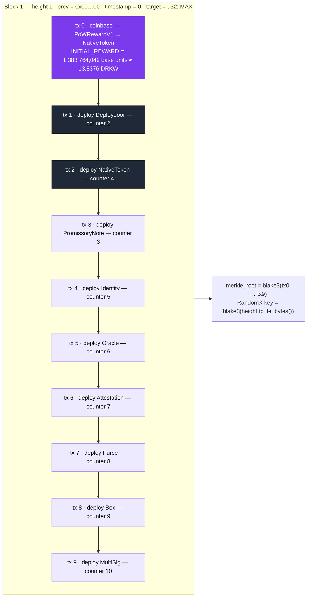

Note the deployment order is **not** counter order: NativeToken (counter 4) is deployed at position 2, before PromissoryNote (counter 3). Binding is by table position in `genesis_contracts()`, not by key — the Book explicitly calls the older counter‑sorted listing "a trap". 🦀

### 1.2 Contract registry

| Pos | Counter | Contract | Crate | Consensus‑critical? | Role |
|---:|---:|---|---|:---:|---|
| 1 | 2 | **Deployooor** | `dwow_deployooor_contract` | ✅ | The infrastructure contract that allows all subsequent WASM smart contracts to be deployed and locked immutably on‑chain. |
| 2 | 4 | **NativeToken** | `dwow_native_token_contract` | ✅ | A deliberately "rock‑dumb" contract handling only block rewards (coinbase), transaction fee payments, and the strict Pedersen mass‑balance supply audit. No multi‑token support, governance hooks, or freezing — minimal consensus attack surface. |
| 3 | 3 | **Promissory Note** | `dwow_promissory_note_contract` | — | The privacy‑first DeFi token layer: token creation, minting, private transfers, and atomic swaps for the entire ecosystem. Poseidon‑only ZK circuits, zero EC operations in‑circuit. |
| 4 | 5 | **Identity** | `dwow_identity_contract` | — | The authorization layer issuing ZK‑verifiable credentials so users can prove capabilities (e.g. "can vote") without revealing identity. |
| 5 | 6 | **Oracle** | `dwow_oracle_contract` | — | External data feeds using a "push model" to bring off‑chain data on‑chain. |
| 6 | 7 | **Attestation** | `dwow_attestation_contract` | — | A framework for creating and verifying trusted claims and delegations (predicates, delegation, slashing). |
| 7 | 8 | **Purse** | `dwow_purse_contract` | — | A fungible capability container (hidden balances via Pedersen, hidden token types via Poseidon). |
| 8 | 9 | **Box** | `dwow_box_contract` | — | A capability delegator and restrictor (time locks, spending limits, …); consumed on open via nullifier. |
| 9 | 10 | **MultiSig** | `dwow_multisig_contract` | — | Threshold‑based authorization enabling private, zero‑knowledge voting and multi‑party approvals. |

Machine‑readable copy: [`data/genesis_contracts.csv`](../../data/genesis_contracts.csv) · model: [`code/darkwow_research/genesis.py`](../../code/darkwow_research/genesis.py). 🧪

### 1.3 Two strict categories

The nine genesis contracts are strictly divided by their role in network survival. **Consensus‑critical** — if either fails, the chain halts. **Ecosystem infrastructure** — zero role in block validation, fee payment or coinbase; deployed at genesis only so that every later contract can reference one canonical, well‑known `ContractId` (no fragmentation from replica deployments — the Book compares this to ERC‑20 pre‑deploys on Ethereum testnets or the bank module in Cosmos SDK). 📖 🦀

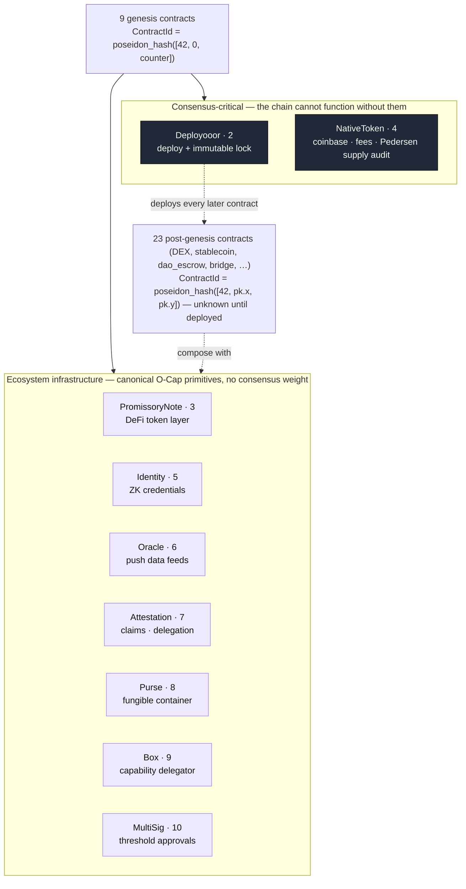

### 1.4 Deterministic `ContractId`s — and why the x‑coordinate is zero

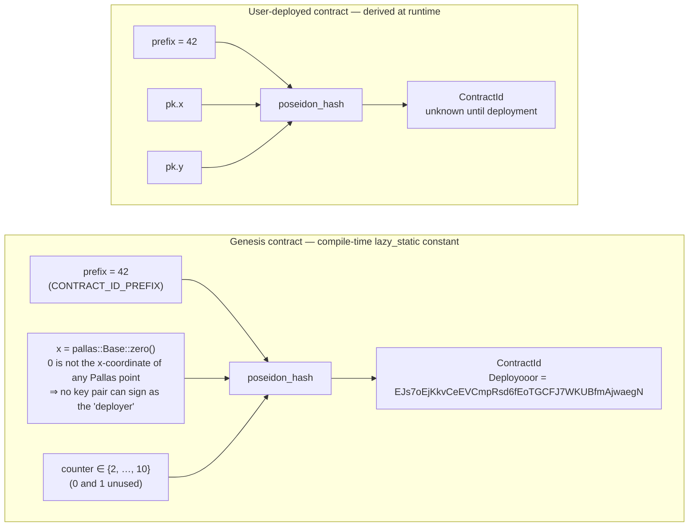

The Rust, verbatim from `src/sdk/src/crypto/contract_id.rs` (abridged): 🦀

```rust
lazy_static! {
    // The idea here is that 0 is not a valid x coordinate for any pallas point,
    // therefore a signature cannot be produced for such IDs. ...
    pub static ref CONTRACT_ID_PREFIX: pallas::Base = pallas::Base::from(42);

    pub static ref DEPLOYOOOR_CONTRACT_ID: ContractId = ContractId::from_base(
        poseidon_hash([*CONTRACT_ID_PREFIX, pallas::Base::zero(), pallas::Base::from(2)]));
    pub static ref PROMISSORY_NOTE_CONTRACT_ID: ContractId = ContractId::from_base(
        poseidon_hash([*CONTRACT_ID_PREFIX, pallas::Base::zero(), pallas::Base::from(3)]));
    pub static ref NATIVE_TOKEN_CONTRACT_ID: ContractId = ContractId::from_base(
        poseidon_hash([*CONTRACT_ID_PREFIX, pallas::Base::zero(), pallas::Base::from(4)]));
    // … Identity 5, Oracle 6, Attestation 7, Purse 8, Box 9, MultiSig 10

    /// Consensus-critical native contract IDs (Deployooor + NativeToken only).
    /// Promissory Note is deliberately excluded — it is ecosystem infrastructure,
    /// not a consensus dependency.
    pub static ref NATIVE_CONTRACT_IDS_BYTES: [[u8; 32]; 2] =
        [DEPLOYOOOR_CONTRACT_ID.to_bytes(), NATIVE_TOKEN_CONTRACT_ID.to_bytes()];
}

impl ContractId {
    /// Derives a `ContractId` from a `SecretKey` (deploy key)
    pub fn derive(deploy_key: SecretKey) -> Self {
        let public_key = PublicKey::from_secret(deploy_key);
        let (x, y) = public_key.xy().expect("pk not identity");
        Self(poseidon_hash([*CONTRACT_ID_PREFIX, x, y]))
    }
}
```

Two consequences worth spelling out:

* **Un‑forgeable ownership.** A user contract's ID commits to a real public key `(x, y)`, so its deployer can sign. Genesis IDs commit to `x = 0`, which no curve point has — therefore *nobody* can ever present a signature claiming to be the deployer of a genesis contract. Immutability is arithmetic, not policy.
* **Zero wallet configuration.** Because the IDs are compile‑time constants, any contract can hard‑reference `PURSE_CONTRACT_ID` or `MULTISIG_CONTRACT_ID` and every node agrees from block 1. 📖

### 1.5 Bootstrap sequence

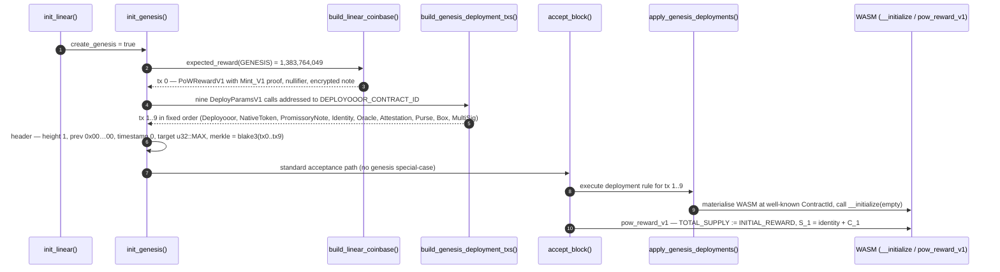

Deployooor and NativeToken carry **empty** manifests; the seven ecosystem contracts carry their `manifest.toml`, stored under `_manifest`‑suffixed keys so wallets can auto‑configure from on‑chain interface declarations. 📖

### 1.6 Genesis header

| Field | Value | Why |
|---|---|---|
| `height` | `1` | `BlockHeight::GENESIS`; height 0 means "no block" and `expected_reward(0) = 0` |
| `previous` | `[0u8; 32]` | No parent |
| `timestamp` | `0` | Deterministic — identical genesis on every node |
| `target` | `u32::MAX` | Any RandomX hash satisfies it; the chain "begins when the first miner finds a block" |
| transactions | 10 | 1 coinbase + 9 deployments |
| `merkle_root` | `blake3(tx0 … tx9)` | |
| coinbase value | `INITIAL_REWARD` (full) | No zero‑reward bootstrap; S₁ = identity + C₁ |

---

## 2. Rationale and differences from DarkFi

Patrick's design of the DarkWow genesis block represents a radical departure from DarkFi. The architecture was specifically chosen to strip away systemic centralization, plutocracy, and points of failure found in DarkFi and other traditional crypto networks.

### 2.1 Side‑by‑side

| Dimension | DarkFi (upstream, as characterised by DarkWow docs) | DarkWow (`linear-master`) | Checked |
|---|---|---|---|
| Governance | Single monolithic DAO contract; ACL‑based, token‑weighted voting | No DAO contract at genesis; six composable O‑Cap primitives (Identity, Oracle, Attestation, Purse, Box, MultiSig) | 📖 🦀 |
| Token architecture | One `Money` contract for consensus **and** DeFi | `NativeToken` (consensus) ⟂ `PromissoryNote` (DeFi) | 📖 🦀 |
| Initial distribution | Pre‑allocations for contributors, investors, SAFT participants | **Zero premine** — every DRKW is mined; block 1 pays the ordinary `INITIAL_REWARD` to whoever mines it | 📖 🦀 |
| Emission | — | Continuous exponential decay, 4‑year half‑life, perpetual 1 %/yr tail; 21 M is a *reference*, not a cap | 🦀 🧪 |
| Consensus | Overlay‑DAG; speculative execution, rollbacks, diffs (`src/validator/`, now deleted) | **Uncle Merkle**: linear, forward‑only, RandomX PoW; competing blocks pinned as uncles and paid | 📖 🦀 |
| Authorization | ACLs — matching a public key to a whitelist reveals the actor | Pure ZK predicates — prove the condition, never the key | 📖 |
| Supply audit | — | Per‑block Pedersen mass balance + cumulative supply commitment chain `S_H = S_{H−1} + C_H` | 📖 🦀 |

### 2.2 Decomposition of the monolithic DAO into O‑Cap primitives

* **DarkFi:** relies on a single, monolithic DAO contract using an ACL‑based (Access Control List), token‑weighted voting model.
* **DarkWow:** rejects the monolithic DAO entirely. Instead, the genesis block deploys six composable Object‑Capability (O‑Cap) primitives. Users and developers build their own modular governance structures by composing these Lego‑like bricks. This prevents whale capture because *"there is no governance token to capture because there is no single governance surface."*

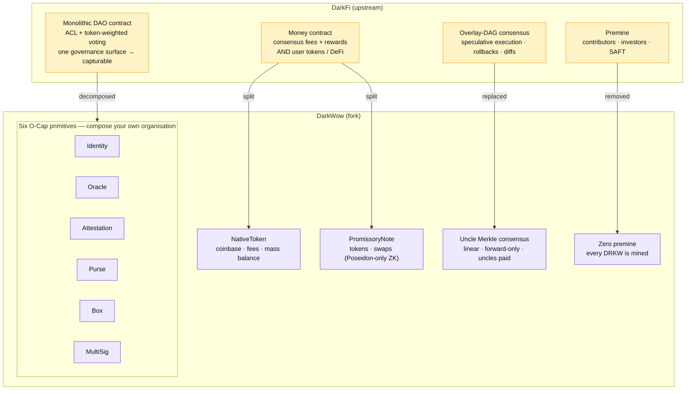

A concrete composition (from the Book's `dao_escrow` case study): a treasury is a **Purse**; spending authority is a **MultiSig** approval capability; that capability is handed over inside a **Box** with a time lock; eligibility to sit on the MultiSig is an **Identity** credential attested by **Attestation**; and a payout condition can be gated on an **Oracle** feed. None of these pieces knows it is "the DAO" — so there is nothing to capture.

### 2.3 The "Money split" (token architecture)

* **DarkFi:** uses a single, massive `Money` contract handling both the consensus layer (fees/rewards) and DeFi operations (user tokens).
* **DarkWow:** splits this into `NativeToken` (consensus) and `PromissoryNote` (DeFi). This isolates the blast radius — a bug in a DeFi token contract cannot halt block production or fee processing.

The Book's phrasing of the design rule: *"Tokens are pipework, not reactors."* NativeToken exposes only what consensus needs (`PoWRewardV1 = 0x05`, `FeeCollectV1 = 0x06`, fee commitments); PromissoryNote carries the DeFi surface (`TokenMintV1 0x00`, `MintV1 0x01`, `BurnV1 0x02`, `TransferV1 0x03`, `OtcSwapV1 0x04`) and keeps **all** in‑circuit cryptography Poseidon‑only — elliptic‑curve work is pushed out to the WASM verification layer, which is how the fork sidesteps the EC‑heap bugs that killed upstream's `money_v2`. 📖

### 2.4 Zero premine vs insider allocation — and the emission that replaces it

* **DarkFi:** launched with pre‑allocations for early contributors, investors, and SAFT participants.
* **DarkWow:** implements a strict zero‑premine policy. Every single DRKW token in circulation is mined through Proof of Work. Patrick structured the genesis block to initiate a Satoshi‑style **continuous exponential decay** emission. The chain begins when the first miner finds a block, ensuring a completely fair launch.

There is no allocation table to audit because there is no allocation. What *can* be audited is the emission function, and it is small enough to read in full. 🦀

```rust
// src/sdk/src/blockchain.rs (linear-master), abridged
pub mod reward {
    pub const INITIAL_REWARD: BlockReward = BlockReward(1_383_764_049); // ⌊2.1e15·ln2 / 1_051_920⌋
    pub const HALF_LIFE_BLOCKS: u64 = 1_051_920;                       // ~4 years at 120 s
    pub const TAIL_REWARD: BlockReward = BlockReward(79_853_981);       // ⌊21e6·0.01·1e8 / 262_980⌋
    pub const BLOCKS_PER_YEAR: u64 = 262_980;
}

pub fn expected_reward(height: BlockHeight) -> BlockReward {
    let height = height.get();
    if height == 0 { return BlockReward::ZERO; }
    if height == 1 { return reward::INITIAL_REWARD; }
    let decay = fixed_pow_decay(height - 1);                 // ≈ 2^(-(h-1)/H) in Q32
    let reward = reward::INITIAL_REWARD.mul_fixed_point(decay);
    if reward <= reward::TAIL_REWARD.0 { return reward::TAIL_REWARD; }
    BlockReward(reward)
}

/// DECAY_FP = floor(2^(-1/H) * 2^32); O(log h) binary exponentiation, u128 intermediates.
fn fixed_pow_decay(mut exp: u64) -> u64 {
    const DECAY_FP: u64 = 4_294_964_465;
    let mut result: u64 = 1 << 32;
    let mut base: u64 = DECAY_FP;
    while exp > 0 {
        if exp & 1 == 1 { result = ((result as u128 * base as u128) >> 32) as u64; }
        base = ((base as u128 * base as u128) >> 32) as u64;
        exp >>= 1;
    }
    result
}
```

Integer‑only on purpose: floating point is forbidden for supply computation so that every CPU produces the same coinbase. The Python port in [`code/darkwow_research/emission.py`](../../code/darkwow_research/emission.py) reproduces it bit‑for‑bit and passes the same unit tests as the Rust (`reward_formula_key_points`, `reward_monotonic_decrease`, `binary_exp_additive_property`). 🧪

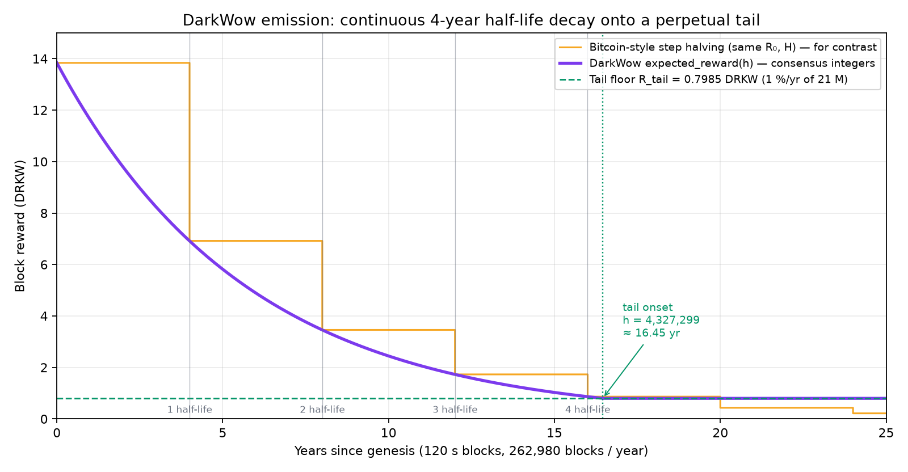

*Continuous decay against a Bitcoin‑style step schedule with the same R₀ and half‑life. There are no cliff events for miners to game, and the curve never reaches zero: at height 4,327,299 (≈ 16.45 years) it meets the tail floor and stays there forever.*

| Milestone | Height | Block reward (DRKW) | Total supply (DRKW) | Annual inflation |
|---|---:|---:|---:|---:|
| genesis | 1 | 13.837640 | 13.84 | — |
| 1 yr | 262,980 | 11.635355 | 3,341,082 | 91.58 % |
| 2 yr | 525,960 | 9.783561 | 6,150,424 | 41.83 % |
| 4 yr (1 half‑life) | 1,051,920 | 6.917220 | 10,498,925 | 17.33 % |
| 8 yr | 2,103,840 | 3.457808 | 15,747,171 | 5.78 % |
| 12 yr | 3,155,760 | 1.728503 | 18,370,685 | 2.47 % |
| 16 yr | 4,207,680 | 0.864051 | 19,682,138 | 1.15 % |
| **tail onset** (≈16.45 yr) | 4,327,299 | 0.798540 | 19,781,525 | 1.06 % |
| 20 yr | 5,259,600 | 0.798540 | 20,526,004 | 1.02 % |
| 50 yr | 13,149,000 | 0.798540 | 26,826,004 | 0.78 % |
| 100 yr | 26,298,000 | 0.798540 | 37,326,004 | 0.56 % |
| 200 yr | 52,596,000 | 0.798540 | 58,326,004 | 0.36 % |

*Exact integer sums — [`data/emission_milestones.csv`](../../data/emission_milestones.csv). Inflation is forward‑looking (one year of emission at that height ÷ supply).* 🧪

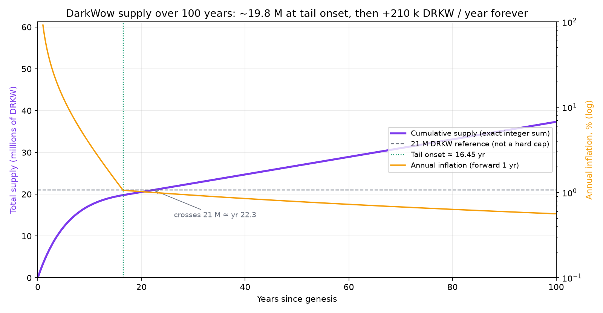

The genesis block is therefore not "the block that allocates" but merely block 1 of the same function every later block follows: `S₁ = identity + C₁`, `total_supply = INITIAL_REWARD`, and from height 2 onward the WASM `pow_reward_v1` enforces `S_H = S_{H−1} + C_H` against `expected_reward(H)`. 📖

### 2.5 Consensus: Uncle Merkle vs Overlay‑DAG

* **DarkFi:** uses a highly complex Overlay‑DAG architecture requiring speculative execution, rollbacks, and diffs to resolve forks.
* **DarkWow:** fully replaced the DAG with **Uncle Merkle** consensus. It is a deterministic, forward‑only, linear blockchain. Competing blocks are not orphaned or subjected to complex DAO adjudication; they are included as "uncles" and share in the PoW reward, making the network Pareto‑efficient and eliminating wasted mining energy.

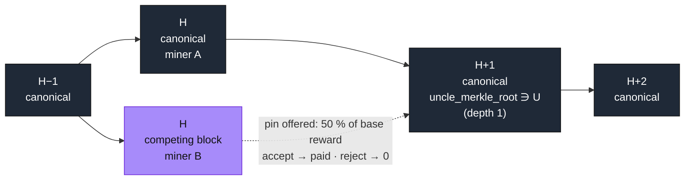

**The pin mechanism (use‑it‑or‑lose‑it).** The canonical chain is *obligated* to offer every valid uncle a pin worth `base_reward / 2^depth` — 50 % at depth 1, halving each level, capped at `MAX_UNCLE_DEPTH = 6`. The uncle miner has a one‑shot accept/reject; accepting pays > 0, rejecting pays 0, so acceptance is strictly dominant. Because the split is **subtractive** — the pins come out of the canonical miner's coinbase — nothing extra is minted. 📖 🦀

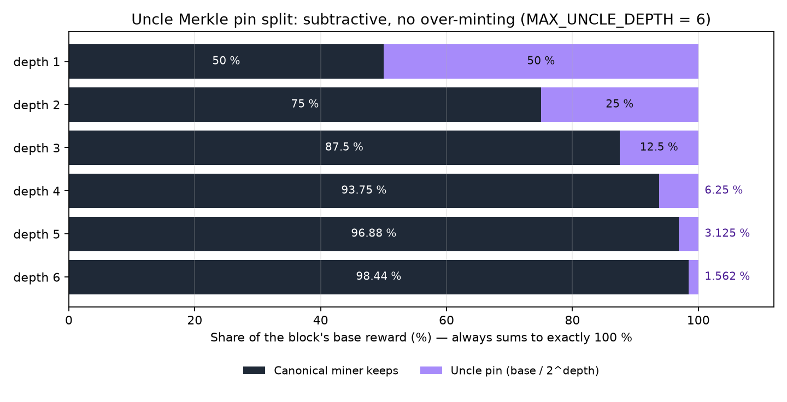

```rust
// src/linear/src/supply_chain.rs — value-level split (verbatim from the Book)
fn compute_reward(base_reward: BlockReward, uncles: &[UncleBlock]) -> (BlockReward, Vec<u64>) {
    let base = base_reward.get();
    if uncles.is_empty() { return (base_reward, vec![]); }
    let mut uncle_rewards = Vec::with_capacity(uncles.len());
    for uncle in uncles {
        let pin = if uncle.pin_accepted { uncle.pin_confirmed.get() } else { 0 };
        uncle_rewards.push(pin);
    }
    let total_pin_confirmed: u64 = uncle_rewards.iter().sum();
    let canonical_reward = base.checked_sub(total_pin_confirmed).unwrap_or(0);
    (BlockReward::new(canonical_reward), uncle_rewards)
}
```

The same invariant, one level down, as Pedersen arithmetic — verified by additive homomorphism with **no extra ZK circuit**:

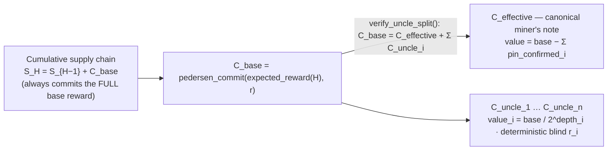

Why this beats the DAG: there is nothing to speculatively execute and nothing to roll back. A competing block either gets pinned (and its transactions absorbed) or it doesn't; state is a pure function of the linear chain, which is also what makes DarkWow's wallet deterministic (*"same keys + same chain = identical wallet state"*). 📖

### 2.6 Privacy and authorization models

* **DarkFi:** relies heavily on ACLs, which inherently reveal the identity of the actor (e.g. matching a public key to a whitelist).
* **DarkWow:** uses pure ZK predicates. A user proves they meet a condition (e.g. they own a credential allowing them to spend treasury funds) via a zero‑knowledge proof, without ever revealing their public key or identity.

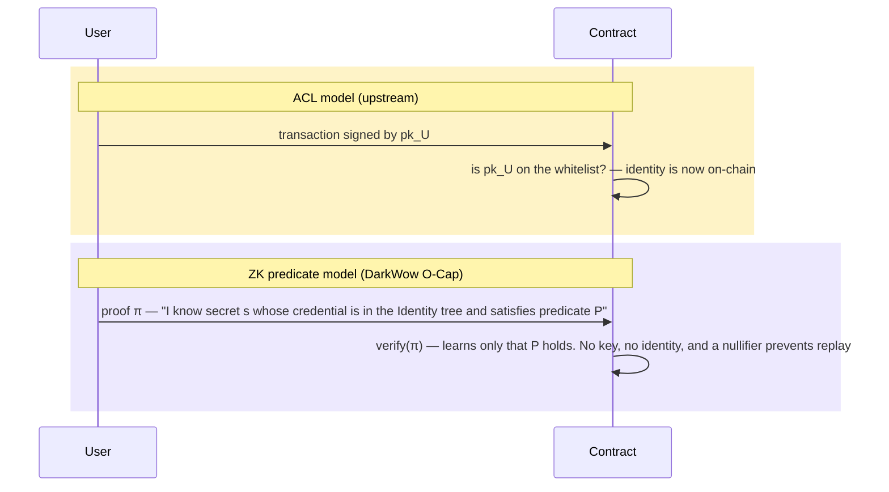

In O‑Cap terms the *secret is the capability*: knowing it **is** the authority, so there is no list to consult and nothing to leak. 📖

---

## 3. The philosophical core

The design of the DarkWow genesis block is rooted in a specific philosophical divergence from DarkFi, which the documentation frames through two trajectories out of Warwick's CCRU: Nick Land's reading of Bitcoin as **chronogenesis in the service of Capital**, and Mark Fisher's left‑accelerationist reading in which the same time‑producing machinery can be turned to other ends. Fisher's *Capitalist Realism* names the belief that there is no alternative to extractive financialisation — and, the Book argues, premines, VC SAFTs and governance‑DAO plutocracy are exactly that belief compiled into smart contracts. *"DarkFi is the Land fork. DarkWow is the Fisher fork. Same technical base … opposite conclusion about what the time being produced is for."* 📖

Patrick designed the genesis block to **remove the affordances for extraction**. By refusing to include a premine and by destroying the monolithic DAO in favour of O‑Cap primitives, DarkWow structurally prevents the plutocratic takeover of the network. The genesis block is built to serve the ecosystem as neutral, thermodynamic infrastructure, ensuring that the "chronogenic time" produced by the blockchain is used for coordination and building rather than pure financial accumulation by early insiders.

Read against block 1, each philosophical claim has a mechanical shadow:

| Claim | Mechanism in block 1 |
|---|---|
| "No affordance for extraction" | Coinbase pays `expected_reward(1)` to an unknown miner; there is no allocation transaction type at all |
| "No single governance surface" | Six primitives with independent `ContractId`s; no contract named "DAO" in genesis |
| "Neutral infrastructure" | Genesis IDs commit to `x = 0` → no deployer, no owner, no admin key |
| "Thermodynamic" | Target `u32::MAX` at height 1: the chain starts the moment work is done, not when a foundation says so |

---

## 4. Findings, discrepancies and open questions

Things that surfaced while re‑deriving the numbers. None are bugs in the sense of "wrong coins get minted" — consensus is whatever the integer code says — but they matter when quoting the spec.

1. **Spec prose vs code exponent.** The Book's §4.2 writes `R(h) = max(R₀ × 2^(−h/H), R_tail)`, while the implementation (and its doc‑comment) uses `2^(−(h−1)/H)` so that `R(1) = R₀` exactly. Off by one block — harmless, but the prose formula under‑states every reward by a factor `2^(−1/H)`. 🦀 🧪
2. **Fixed‑point drift is systematic, not random.** `DECAY_FP = ⌊2^(−1/H)·2³²⌋` is rounded *down*, so consensus rewards sit slightly *below* the real‑valued curve and the gap grows linearly: −232 ppm at one half‑life (6.917216 vs 6.918820 DRKW), ≈ −950 ppm at tail onset. Net effect: the tail floor is reached at height **4,327,299**, about 1,450 blocks (~2 days) earlier than the ideal formula predicts. The Rust test tolerance (1 % at half‑life) comfortably absorbs this. 🧪

   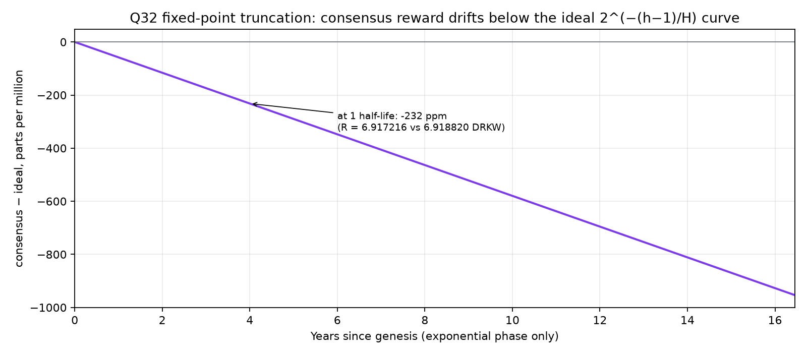

3. **The Book's §4.5 supply table is ~0.5 M DRKW high.** It lists ~21.0 M at 20 years and ~27.3 M at 50 years. The exact integer sum gives **20.53 M** and **26.83 M**: the exponential phase only ever emits ≈ 19.78 M because the tail floor truncates the last ≈ 1.2 M of the geometric series; 21 M is crossed around **year 22.3**, not year 20. The table appears to assume the exponential phase delivers the full 21 M reference before the tail begins. 🧪
4. **Uncle rewards are value‑level only today.** The Book's own status note says the reduced canonical note + per‑uncle spendable notes are the *target* design; the current code still mints the full base reward into the coinbase note and tracks uncle commitments in memory, so uncle pins are computed and verified but **not yet spendable**. Worth tracking as the "Pareto‑efficient" claim depends on it. 📖
5. **Deployment order ≠ counter order.** Position 2 is NativeToken (counter 4), position 3 is PromissoryNote (counter 3). Anyone indexing genesis by counter will mis‑bind two contracts. 🦀
6. **Open — DarkFi side of the comparison.** The upstream characterisations (overlay‑DAG, `Money` monolith, token‑weighted DAO, SAFT allocations) are taken from DarkWow's *Differences from Upstream* page and have not been independently checked against `darkrenaissance/darkfi` at the fork point.
7. **Open — poseidon IDs.** The base58 IDs for the eight non‑Deployooor genesis contracts are not printed in the source comments; regenerating all nine with the Rust crate (and pinning them in `data/`) is a cheap follow‑up.

---

## 5. Reproduce

```bash
git clone https://github.com/9lordisgod/DarkWow-Chain-Research
cd DarkWow-Chain-Research
python3 -m pip install -r code/requirements.txt

# unit tests mirroring the upstream Rust tests + the claims in this note
( cd code && python3 -m pytest )

# regenerate every chart in weeks/week-01/charts/ and table in data/ (~20 s)
python3 code/plot_charts.py

# poke at the models directly
python3 -m code.darkwow_research.emission 1 2 1051921 4327299
python3 -m code.darkwow_research.uncle_split
python3 -m code.darkwow_research.genesis
```

To check a quote against the primary source, the Book's text was extracted with `pypdf`; page numbers in the PDF snapshot: genesis contract table ≈ pp. 123–125 and 903–907; emission constants ≈ pp. 645–647; uncle pin mechanism ≈ pp. 337–339 and 366–368; fork history ≈ pp. 1921–1923.

---

## 6. References

* **DarkWow source** — <https://github.com/PatrickMockridge/DarkWow> (mirror of <https://codeberg.org/PatrickM123/darkwow>), branch `linear-master`, AGPL‑3.0‑only.
  * `src/sdk/src/crypto/contract_id.rs` — genesis `ContractId` constants and derivation
  * `src/sdk/src/blockchain.rs` — `reward` constants, `expected_reward()`, `fixed_pow_decay()`, `BlockReward::split_for_uncle()`
  * `src/linear/src/supply_chain.rs` — `compute_reward()`, `verify_uncle_split()`
  * `bin/dwowd/src/lib.rs` — `init_genesis()`, `build_genesis_deployment_txs()`
  * `doc/src/arch/genesis.md`, `doc/src/arch/consensus/consensus.md`, `doc/src/arch/consensus/uncle_merkle.md`, `doc/src/arch/ocap.md`, `doc/src/about/differences_from_upstream.md`, `doc/src/philosophy/philosophy.md`
* **The DarkWow Book** — PDF export of `doc/` dated 2026‑09‑03 (2,014 pp.). Provenance and checksum in [`sources/README.md`](../../sources/README.md).
* Mark Fisher, *Capitalist Realism: Is There No Alternative?* (2009). Nick Land, *Cryptocurrent* (2018). Cited by the Book's *History of the Fork*.
* Week 1 original notes — [Google Doc](https://docs.google.com/document/d/1G5zCkHBF2VW92Cn9dtDrSdRFjtlWLs5aJD4qQeSaiHM/edit?usp=sharing).
