# Week 2 — O‑Cap Governance Primitives vs. Monolithic DAOs: four bug claims, read against the code

| | |
|---|---|
| **Research window** | 2026‑09‑28 → 2026‑10‑04 |
| **Author** | [@9lordisgod](https://github.com/9lordisgod) |
| **Subject** | [PatrickMockridge/DarkWow](https://github.com/PatrickMockridge/DarkWow) — branch `linear-master`, commit `d775e37c` (Week 1 read `ec914970`; where the two differ it is said so) |
| **Primary sources** | *The DarkWow Book* (mdbook export, 2026‑09‑03 — see [`sources/`](../../sources/README.md)): trust model p. 6, governance primitives pp. 18 & 187, oracle pp. 975–979, attestation pp. 981–983, DAO escrow pp. 1142–1163, composability pp. 1171–1176, transaction binding p. 1251 · `src/contract/{purse,box,identity,multisig,oracle,attestation,dao_escrow,escrow,promissory_note}/` (circuits, entrypoints, manifests) · `src/sdk/src/dark_tree.rs` · `src/tx/mod.rs` · `src/linear/src/{execution,zk_verifier}.rs` · `src/runtime/import/db.rs` · `src/zkas/opcode.rs` · `bin/dww/src/{dispatch,manifest_resolver}.rs` · `src/sdk/src/manifest.rs` · `doc/src/arch/{manifest,verification-hazop}.md` · `doc/src/contract/{oracle,tx-commitment}.md` |
| **Original write‑up** | [Google Doc](https://docs.google.com/document/d/1G5zCkHBF2VW92Cn9dtDrSdRFjtlWLs5aJD4qQeSaiHM/edit?usp=sharing), Week 2 section (this page is the expanded, diagrammed and code‑verified version) |
| **Reproduce** | `python3 code/plot_charts.py` · `cd code && pytest` — see [§9](#9-reproduce) |

> **TL;DR** — The Week 2 brief states four bugs in the way DarkWow's six **O‑Cap governance primitives** (Purse, Box, Identity, MultiSig, Oracle, Attestation) compose into a DAO. Read against the Book and the code at `d775e37c`, the four claims land in four different places. **BUG‑01** (CRITICAL, execution reordering in Box/Purse composition) *cannot be reproduced as written*: the DAO it targets no longer calls Box or Purse at all, call order is a structural property of the DarkTree (children run before parents, a parent reads its children by slot and selector) rather than something a compiler enforces, and a failing call rejects the whole block — but the reading surfaces a *real* residual in the same place: parents check wire fields that the child's proof never publishes (`contents_commit`, `amount`), which the register already tracks as OBL‑C171 OPEN. **BUG‑02** (HIGH, attestation replay) is *confirmed and understated*: eight of the ten attestation circuits publish nothing but a constant `tx_binding = H(3, 0, 0)`, `VerifyClaimV2` hashes the evidence and throws the hash away, and an attestation in anyone's name can be minted, claimed and verified with one secret — the forger's. **BUG‑03** (HIGH, stale oracle masking) is *not applicable*: there is no oracle path in the DAO and the host forbids cross‑contract reads, so the "host fn fetching oracle state" cannot exist; what *is* true is that freshness is a consumer obligation the Book states and no consumer performs, and the brief's "< 5 block" window would reject ≈ 46 % of honest reads at a 10‑block cadence. **BUG‑04** (MEDIUM, manifest spoofing) is *real but wallet‑side*: the manifest is self‑reported TOML, the trust model's layer 2 prints "not implemented", and 6 capability names are shared by 2–5 contracts — yet the VM never dispatches on it. Underneath all four sits one cross‑cutting fact this note also uses to correct Week 1: the fourth stage of the `tx_binding` chain — a node comparing the proof's binding against the enclosing transaction — does not exist, and 19 of 32 contracts publish the same constant binding for every proof. Every count is re‑derived in [`code/`](../../code/) (5 new models, 102 new tests, 8 charts, 13 diagrams).

---

## Contents

0. [Method — how to read a bug claim](#0-method--how-to-read-a-bug-claim)
1. [Six primitives, and who actually composes them](#1-six-primitives-and-who-actually-composes-them)
2. [The DAO the brief describes vs. the DAO that shipped](#2-the-dao-the-brief-describes-vs-the-dao-that-shipped)
3. [BUG‑01 — execution reordering in Box/Purse composition](#3-bug01--execution-reordering-in-boxpurse-composition)
4. [BUG‑02 — attestation replay and the missing identity binding](#4-bug02--attestation-replay-and-the-missing-identity-binding)
5. [BUG‑03 — stale oracle state masking](#5-bug03--stale-oracle-state-masking)
6. [BUG‑04 — capability aliasing through `manifest.toml`](#6-bug04--capability-aliasing-through-manifesttoml)
7. [Cross‑cutting: the `tx_binding` chain, the verification register, two Week 1 corrections](#7-crosscutting-the-tx_binding-chain-the-verification-register-two-week-1-corrections)
8. [Findings, discrepancies and open questions](#8-findings-discrepancies-and-open-questions)
9. [Reproduce](#9-reproduce)
10. [References](#10-references)

---

## 0. Method — how to read a bug claim

The Week 2 brief is a vulnerability write‑up: four numbered bugs, each with a severity, an affected component, an attack narrative and a remediation. This note treats each as a **hypothesis** and asks the same five questions of it, in order:

| # | Question | Where it is answered |
|---|---|---|
| Q1 | Does the component the claim names still exist in that shape? | `manifest.toml`, `lib.rs` selectors, the Book's own chapter |
| Q2 | Is the mechanism the claim relies on a real mechanism? | the entrypoint, the host imports, the node's execution loop |
| Q3 | Can the attack be written down as a transaction the node would accept? | a Python model of the call tree / state machine, with the attack as a test |
| Q4 | What does the project's own verification register say? | `doc/src/arch/verification-hazop.md` (242 obligations at `d775e37c`) |
| Q5 | If the claim is wrong, is there a *neighbouring* claim that is right? | the same sources, read one layer down |

Q5 is the important one. Three of the four claims are wrong in their mechanism, and in all three cases the wrong mechanism sits next to a real one. Reporting "not reproducible" and stopping would have missed the most useful results in this note.

Claims are tagged as in Week 1:

| Tag | Meaning |
|---|---|
| 📖 **Book** | Stated in *The DarkWow Book* (2026‑09‑03 export) — which, for the DAO escrow, describes a design that predates the code read here |
| 🦀 **Source** | Read directly from the Rust / zkas / TOML source at `d775e37c` |
| 🧪 **Re‑derived** | Reproduced by the Python models in [`code/darkwow_research/`](../../code/darkwow_research/) and asserted by [`code/tests/`](../../code/tests/) |

Two scoping notes. First, the Book's DAO escrow chapter (pp. 1142–1163) and the shipped `dao_escrow` crate disagree substantially — the brief was evidently written from the Book, and [§2](#2-the-dao-the-brief-describes-vs-the-dao-that-shipped) is where the two are reconciled before any bug is assessed. Second, nothing here was exercised against a running node; every "accepted / rejected" statement is a static reading of the entrypoints confirmed by a model whose rules are quoted from those entrypoints line by line.

---

## 1. Six primitives, and who actually composes them

The Book's thesis is that governance should be *composed* from genesis primitives rather than inherited from a monolithic DAO: *"Six composable governance contracts replace the monolithic DAO"* (p. 18) and, as a requirement, *"RG‑8. Governance SHALL be composed from the genesis o‑cap primitives, not a monolithic DAO"* (p. 187). The six are Identity, Oracle, Attestation, Purse, Box and MultiSig; with Deployooor, NativeToken and PromissoryNote they make up the nine genesis contracts of Week 1. 📖

### 1.1 What each primitive is, in one line of code

| Primitive | Selectors | Circuits | The one thing it does | Its unit of authority |
|---|---:|---:|---|---|
| **Purse** | 4 | 3 | a fungible balance that moves by `Deposit`/`Withdraw` | a leaf `H(5, purse_id, balance, nonce, owner_pub)` + a nullifier |
| **Box** | 3 | 2 | a one‑shot capability: `Put` creates it, `Take` exercises it exactly once | a leaf `H(5, box_id, contents_commit, nonce, owner_pub)` + a nullifier |
| **Identity** | 8 | 2 | credentials and capability grants (`IssueCredential`, `VerifyCapability`) | a credential commitment |
| **MultiSig** | 4 | 3 | `CreateGroup` → `Sign` → `Finalize` a message hash at threshold | `FinalizeV1(group_id, message_hash)` |
| **Oracle** | 6 | 6 | an operator pushes a `value`; `updated_at` is the block it landed in | the oracle record |
| **Attestation** | 14 | 10 | attestor → attestation → claimant → claim → consume | an attestation id |

(Counts from `lib.rs` / `manifest.toml` / `proof/*.zk` at `d775e37c`; the 41 circuits across these six plus PN, dao_escrow and escrow are tabulated in [`data/ocap_circuit_stats.csv`](../../data/ocap_circuit_stats.csv).) 🦀 🧪

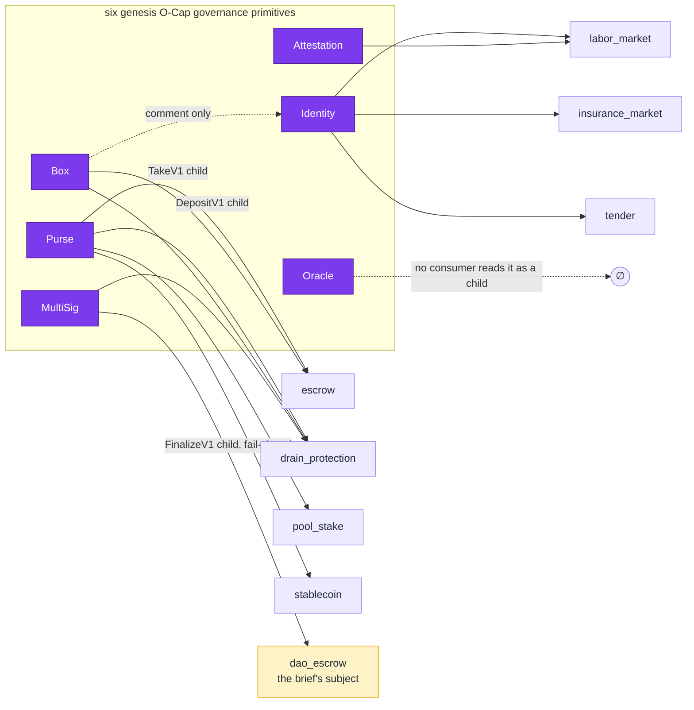

*Who references whose `*_CONTRACT_ID` from an entrypoint at `d775e37c` (solid = read in a child‑call check; dashed = mentioned but never read). Nine contracts compose at least one primitive. The Oracle has no child‑call consumer at all.* 🦀 🧪

### 1.2 The composition matrix

The diagram above is the primitive‑only slice of a 7 × 32 matrix: every contract's `entrypoint*.rs` and `lib.rs` were searched for the six primitives' and PN's contract‑id constants, and each hit classified as *read in a child‑call check* (the parent decodes and validates the child's params), *constant declared in `lib.rs` but never read*, or *comment only*.

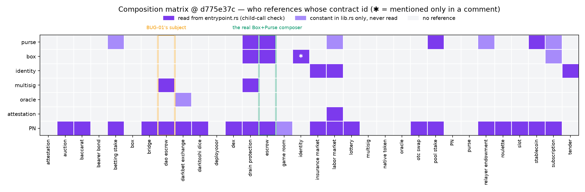

Three things the matrix settles before any bug is discussed:

* **`dao_escrow` composes MultiSig and PN — nothing else.** Its column has exactly two solid cells. There is no Box, Purse, Identity, Oracle or Attestation reference in its entrypoint, and no constant for them in its `lib.rs`. 🦀 🧪
* **The contract that really composes Box *and* Purse is `escrow`** (`FundV1` takes a PN transfer at slot 0 and a Purse deposit at slot 1; `ClaimV1` a PN transfer and a Box take; `RefundV1` a PN transfer alone), with `drain_protection` second. If a Box/Purse composition bug exists it lives there, and [§3.3](#33-the-real-residual-what-the-parent-reads-that-the-proof-never-published) goes there. 🦀
* **The Oracle row is empty.** `darkbet_exchange` declares `ORACLE_CONTRACT_ID` and never reads it; no contract validates an Oracle child call. The Book's Oracle → Attestation → consumer flow (p. 976) is documented, not wired. 📖 🦀

Full matrix with the reference kind per cell: [`data/composition_matrix.csv`](../../data/composition_matrix.csv).

### 1.3 How much each circuit actually constrains

The last structural fact needed before the bugs: how much of what a contract *checks* is backed by what its circuit *proves*. For each of the 41 circuits in the nine contracts above, the number of `constrain_instance` calls (values the verifier sees) and `constrain_equal` calls (equalities proven between in‑circuit values) was counted from the `.zk` source.

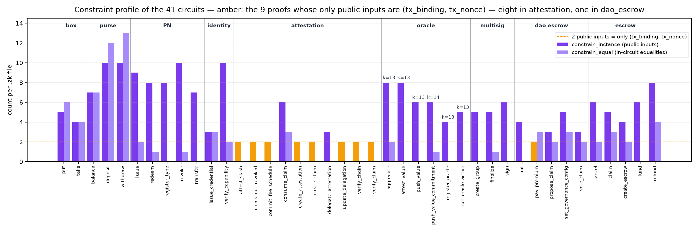

The amber bars are the nine circuits whose **only** public inputs are `(tx_binding, tx_nonce)` — eight of attestation's ten, and `dao_escrow`'s `pay_premium`. Such a proof tells the verifier *that the prover ran the circuit*, and nothing about which attestation, which claimant or which value; everything the entrypoint then checks it checks against the wire. This single picture is most of [§4](#4-bug02--attestation-replay-and-the-missing-identity-binding). 🦀 🧪

---

## 2. The DAO the brief describes vs. the DAO that shipped

All four bugs name `dao_escrow` ("Treasury‑Only mode", "Treasury + Endowment mode") as the affected component. The Book's chapter and the shipped crate describe two different contracts with the same name, and the brief's attack surface is the Book's.

### 2.1 Book era: a DAO assembled from five primitives

The Book (pp. 1142–1148) presents `dao_escrow` as the showcase composition — *"combines Box and Purse"* with four roles (`board_treasury`, `board_endowment`, `member_vote`, `dispute_arbitrator`) each gated by a Box capability, membership checked through an Identity child call, disputes resolved by an Oracle → Attestation → 3‑of‑5 arbitrator flow, and seventeen entrypoints (pp. 1145–1146). Two of its stated rules matter for BUG‑01: the child‑call check inspects `data[0]` — the selector byte — of each child (p. 1172, composability chapter), and when `governance_active = false` the capability‑gated entrypoints are *"Open (any caller)"* (p. 1147). 📖

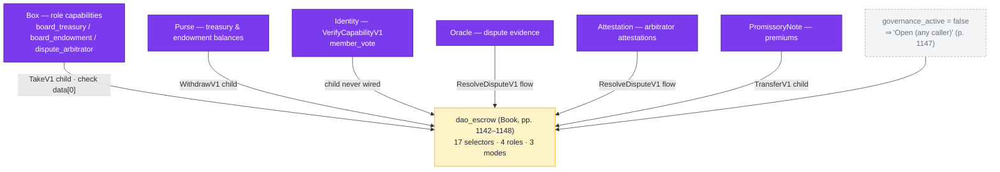

### 2.2 Code era: a DAO that composes exactly two things

At `d775e37c` the crate keeps the name and the mode vocabulary and replaces the mechanism. Treasury and endowment withdrawals require a **`multisig::FinalizeV1` child at slot 1** whose message hash is `governance_message(role, action_id) = H(11, role, action_id)`; the check is fail‑closed — `GovernanceNotActive`, a missing child, the wrong selector, the wrong contract id, the wrong group or the wrong message each reject (`entrypoint.rs:1097–1150`). The balance guard that used to stand in `treasury_spend_v1` is gone, with the comment *"the guard that stood here was `if false { … }`"* (`entrypoint.rs:1039`) — a Book‑era refusal that no input could reach. 🦀

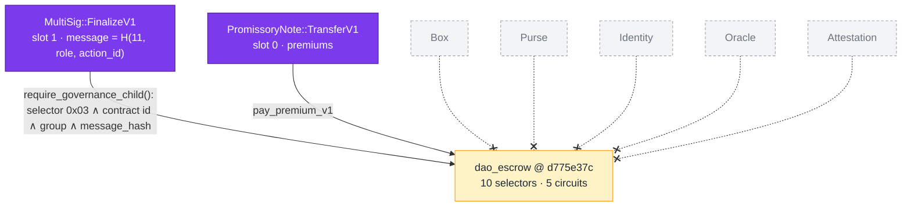

```rust
// src/contract/dao_escrow/src/entrypoint.rs — require_governance_child (1097–1150), abridged
if this_call.children_indexes.len() <= child_slot { return Err(InvalidChildrenIndexes) }
let child_call = &calls[this_call.children_indexes[child_slot]].data;
if child_call.data[0] != 0x03 { return Err(InvalidChildCall) }           // multisig::FinalizeV1
validate_child_contract_id(&child_call.contract_id, &multisig_cid)?;      // not just data[0]
let child = FinalizeParamsV1::decode(child_call.data.get(1..))?;
if child.group_id.inner() != endowment.multisig_group_id { return Err(GovernanceApprovalForeignGroup) }
if child.message_hash != message { return Err(GovernanceApprovalWrongMessage) }
```

### 2.3 What happened to the seventeen selectors

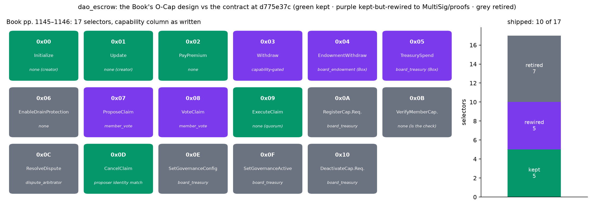

Of the Book's seventeen selectors, **five are kept, five are rewired, seven are retired**; the code has ten (`0x00–0x05, 0x07–0x09, 0x0D`). Every retired or rewired row removes one of the mechanisms the brief relies on:

| Book selector | Fate | What replaced it |
|---|---|---|
| `0x03 WithdrawV1` (capability‑gated) | rewired | owner's `SetGovernanceConfigV2` proof |
| `0x04 EndowmentWithdrawV1` / `0x05 TreasurySpendV1` (`board_*` Box) | rewired | `MultiSig::FinalizeV1` child, fail‑closed |
| `0x07 ProposeClaimV1` / `0x08 VoteClaimV1` (`member_vote`) | rewired | membership / group proofs, no Identity child |
| `0x06 EnableDrainProtectionV1` | retired | flag nothing read — OBL‑C151 CLOSED |
| `0x0A/0x0B/0x10` capability‑requirement registry | retired | `Identity::VerifyCapabilityV1` child never wired |
| `0x0C ResolveDisputeV1` (`dispute_arbitrator`) | retired | Oracle → Attestation → 3‑of‑5 flow never implemented |
| `0x0E SetGovernanceConfigV1` / `0x0F SetGovernanceActiveV1` | retired | folded into `UpdateV1`; the fail‑open flag is gone |

Per‑row detail with the Book page for each: [`data/dao_escrow_selectors.csv`](../../data/dao_escrow_selectors.csv). 📖 🦀 🧪

So, before any mechanism is examined: the Box/Purse DAO of BUG‑01, the oracle‑reading DAO of BUG‑03, and the Identity‑gated DAO whose absence BUG‑02's remediation would fix, are the Book's DAO. The remainder of this note assesses each bug against **both** — the design the brief read, and the code that shipped — because the Book's design is also the one third parties will build from.

---

## 3. BUG‑01 — execution reordering in Box/Purse composition

> **The claim (CRITICAL).** In Treasury‑Only mode a transaction can be assembled so that the Purse transfer executes *before* the Box capability check, bypassing authorisation; the proposed remediation is "ZKAS compiler dependency enforcement".

Three mechanisms are asserted: (a) that `dao_escrow` composes Box and Purse — [§2](#2-the-dao-the-brief-describes-vs-the-dao-that-shipped) showed it no longer does, so the rest of this section reads `escrow` (which does) and the Book‑era design; (b) that call order is something an attacker chooses and a compiler could constrain; (c) that an out‑of‑order child leaves its effect behind. Each is checked against the node.

### 3.1 Order is a property of the tree, not of the attacker

A DarkWow transaction's calls are a **DarkTree** — *"a DFS post‑order traversal Tree"* (`src/sdk/src/dark_tree.rs:92`) — flattened into a vector in which every child precedes its parent and the root is last. Each leaf carries `parent_index` and `children_indexes`; `build()` assigns them, `integrity_check()` rejects a vector that is not a valid post‑order, and the node re‑runs that reconciliation on the wire bytes before executing anything (`zk_verifier.rs:60–95`, *"root last, with `children_indexes` naming the earlier leaves"*). The bounds are `MIN_TX_CALLS = 1`, `MAX_TX_CALLS = 20` (`src/tx/mod.rs:160–171`), with 255 as the encoding ceiling. 🦀

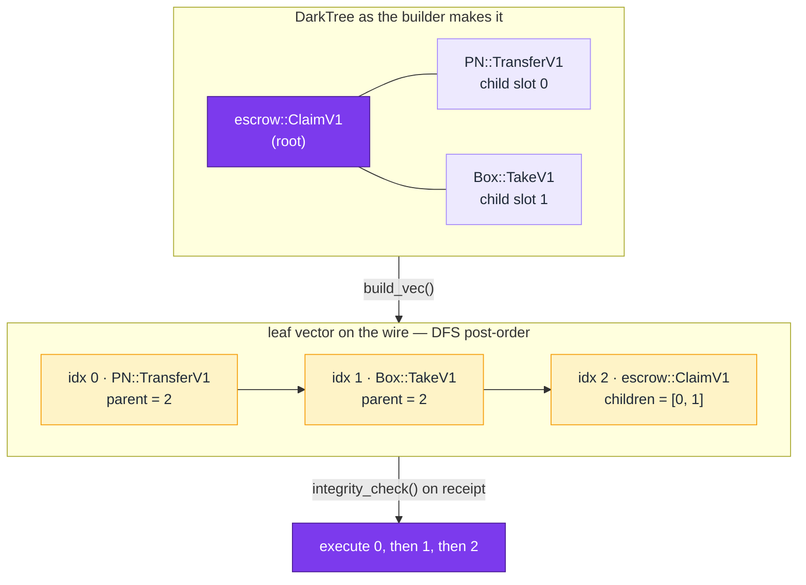

Two consequences follow directly. **Children always execute before their parent** — there is no interleaving in which the parent's check runs first and a child slips in afterwards. And **the parent does not care about global position**: it reads *its* children by slot (`this_call.children_indexes[1]`), checks the selector byte, the contract id and the decoded params, and rejects if any is wrong. The only freedom an attacker has is to permute siblings or omit one, and both are caught by the slot check:

```python
# code/darkwow_research/call_tree.py — the escrow ClaimV1 rules transcribed from entrypoint.rs:507–618
tx = ct.escrow_claim("E1", [ct.pn_transfer("V"), ct.box_take("C_claim")])     # builder order
st, tr = ct.execute(tx, ct.ESCROW_HANDLERS, ct.funded_escrow_state())
assert tr.accepted and tr.executed == [0, 1, 2]

swapped = ct.escrow_claim("E1", [ct.box_take("C_claim"), ct.pn_transfer("V")])
st, tr = ct.execute(swapped, ct.ESCROW_HANDLERS, ct.funded_escrow_state())
assert not tr.accepted and tr.failed_at == 2 and tr.reason == "slot 0: wrong contract box"
assert st == ct.funded_escrow_state()                                           # children rolled back
```

The remediation does not fit either. The zkas compiler (`src/zkas/opcode.rs`) has **32 opcodes**, all of them field, EC, Merkle and constraint operations inside one circuit; it has no notion of a *call*, a *contract* or a *transaction*, so there is nothing for "dependency enforcement" to attach to. Ordering is enforced where it exists — in the SDK's tree builder and the node's reconciliation — not in a circuit compiler. 🦀 🧪

### 3.2 A failing call does not leave a child's effect behind

The execution loop walks the flattened vector in order, one WASM runtime per call, with a shared overlay. Before each call the overlay is checkpointed; a failing `exec()` or `apply()` reverts to the checkpoint, *"leaving zero writes from this call"* (`src/linear/src/execution.rs:86–87, 415–416`). But the node is stricter than per‑call atomicity: a canonical call that fails makes **the block** invalid — `return Err("canonical call failed at {stage} for tx {} call_idx={} …")` (`execution.rs:566–574`) — because the miner re‑executed the same transaction at assembly and should never have included it. There is no reachable state in which a child's Purse withdraw stands and the parent's check did not pass. 🦀

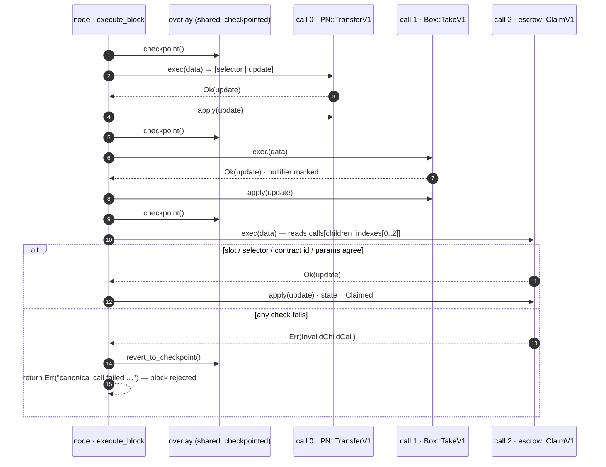

The Python model (`call_tree.execute`) reverts the *transaction* on failure rather than the block; the test `test_rejection_reverts_children_that_already_ran` asserts that the two child nullifiers spent at steps 2–8 are gone afterwards. Either way the brief's end state — "Purse transferred, Box never checked" — is not constructible. 🧪

### 3.3 The real residual: what the parent reads that the proof never published

Reading `escrow::ClaimV1` to confirm the above exposes the gap that *is* there. The parent binds the Box child to *this* escrow with one comparison:

```rust
// src/contract/escrow/src/entrypoint.rs:540–580 (ClaimV1), abridged
let box_call = &calls[this_call.children_indexes[1]].data;
if box_call.data[0] != 0x02 { return Err(InvalidChildCall) }                       // Box::TakeV1
validate_child_contract_id(&box_call.contract_id, &*BOX_CONTRACT_ID)?;
let box_params = TakeParams::decode(&box_call.data[1..])?;
if box_params.contents_commit != escrow.claim_box_contents { return Err(InvalidChildCall) }  // "this escrow's box"
```

…and `contents_commit` is a field **the Box proof never constrains**. `take.zk` publishes exactly four values — `nullifier`, `expected_root`, `tx_binding`, `tx_nonce` (`take.zk:39–53`; `take_metadata`, `box/src/entrypoint/mod.rs:77–84`). The leaf it opens is `H(5, box_id, contents_commit, nonce, owner_pub)`, so the proof *does* know the real contents — but it never tells the verifier, and the wire field the parent compares is whatever the caller typed. The box crate says so itself: *"a parent that must bind to a specific child object needs *something* public about that object, and an L1 object's whole purpose is to publish nothing … That design step is recorded rather than taken"* (`box/src/model/mod.rs:182–197`). The register has it as **OBL‑C171 OPEN**: *"the box circuit constrains `owner_pub == ec_mul_base(owner_secret, NULLIFIER_K)` and folds it into the leaf, so possession *is* proved — to the box contract — but `TakeParams` carries only a commitment, so the parent sees that *someone* who knew some secret moved *some* box"*. 🦀

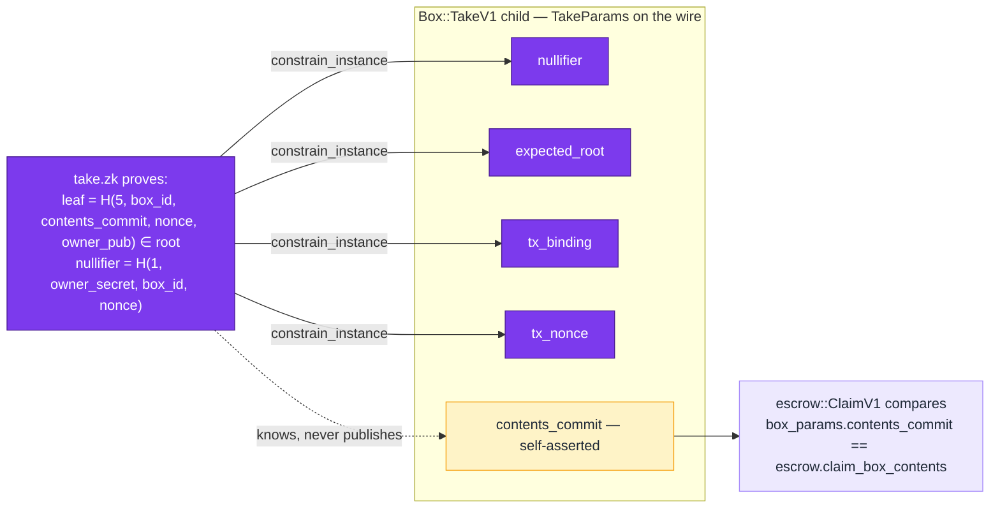

What this permits — and what it does not — is best stated as the model's two tests:

```python
# any box with the right wire: accepted
lie = ct.escrow_claim("E1", [ct.pn_transfer("V"), ct.box_take("C_claim", nullifier="nf_some_other_box")])
assert ct.execute(lie, ct.ESCROW_HANDLERS, ct.funded_escrow_state())[1].accepted
# the right box with an honest wire for a different commitment: rejected
honest = ct.escrow_claim("E1", [ct.pn_transfer("V"), ct.box_take("C_other")])
assert ct.execute(honest, ct.ESCROW_HANDLERS, ct.funded_escrow_state())[1].reason.startswith("InvalidChildCall")
```

So a caller who owns *any* valid Box can satisfy the "this escrow's box" check by writing the expected commitment on the wire. In the shipped `escrow` this is not a theft: the seller's authority rests on escrow's **own** `claim.zk`, which binds `escrow_id`, `escrow_seller_commitment` and `spent_nullifier` to `seller_secret` (`claim.zk:91–96`) — the Box child is, in the crate's words, *"a box‑shaped formality"*. In the **Book‑era `dao_escrow`**, where the Box child *was* the authority (`board_treasury` via Box, p. 1142), the same self‑asserted field would have been the whole gate. Purse has the same shape: `WithdrawParams.amount` is a plaintext `u64` beside a Pedersen commitment that *is* published (`withdraw.zk:91–97`), so a parent that reads `amount` instead of `value_commit` reads an unproven number. 🦀 🧪

```python
tx = ct.dao_treasury_spend_book([ct.purse_withdraw(100), ct.box_take("C_board", nullifier="nf_random_box")])
st, tr = ct.execute(tx, ct.BOOK_DAO_HANDLERS, {"board_treasury_box": "C_board"})
assert tr.accepted          # Book-era TreasurySpendV1: any box, right wire, treasury spent
```

### 3.4 Verdict

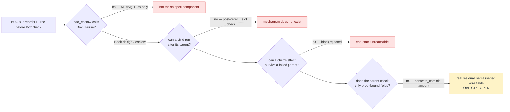

**Not reproducible as written; the neighbouring defect is real and already registered.** The Book‑era DAO *did* have two genuine fail‑open paths the brief could have cited instead — child checks on `data[0]` alone (p. 1172) and `governance_active = false ⇒ "Open (any caller)"` (p. 1147) — and both are gone at `d775e37c` (OBL‑C151 CLOSED, OBL‑C152 FIXED). 📖 🦀 🧪

---

## 4. BUG‑02 — attestation replay and the missing identity binding

> **The claim (HIGH).** An attestation note can be replayed because nothing binds it to an identity credential; remediation: bind attestations to Identity.

This one is right, and smaller than the truth. The attestation contract has fourteen selectors (the Book's table lists thirteen, p. 983; `0x0D CheckAttestationV1` is new), ten of which carry a proof. The question for each is: *who is allowed to do this, and what proves they are that party?*

### 4.1 Where authority is checked — and where it is not

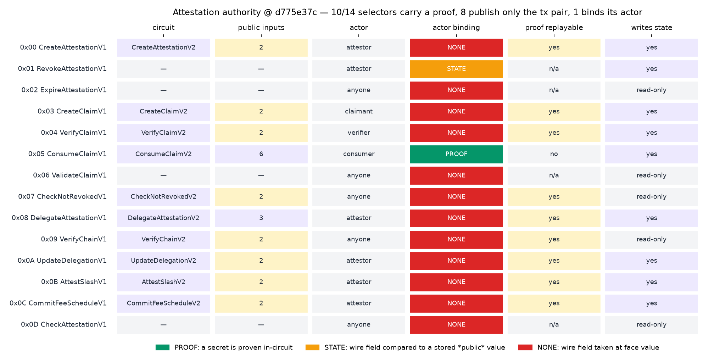

Reading each entrypoint arm against its circuit (`attestation/src/entrypoint.rs:145–355` for `get_metadata`, `438` onward for the handlers; `proof/*.zk`) gives the table above ([`data/attestation_authority.csv`](../../data/attestation_authority.csv)):

* **8 of 10 circuits publish only `(tx_binding, tx_nonce)`.** `CreateAttestationV2` witnesses `attester_secret`, `attester_pub_x/y` and never relates them to anything; `VerifyClaimV2` computes `evidence_hash`, `attestation_hash` and `leaf` and constrains none of them. The circuits are, verbatim:

```text
# src/contract/attestation/proof/verify_claim.zk  (k = 11)
witness "VerifyClaimV2" { Base evidence, Base attestation_data, Base nonce,
                          Base tx_commitment, Base tx_nonce, Base tx_binding, }
circuit "VerifyClaimV2" {
    evidence_hash    = poseidon_hash(DOMAIN_COMMITMENT, evidence);        # computed, discarded
    attestation_hash = poseidon_hash(DOMAIN_COMMITMENT, attestation_data); # computed, discarded
    leaf             = poseidon_hash(DOMAIN_COMMITMENT, nonce);            # computed, discarded
    tx_binding = poseidon_hash(DOMAIN_TX_BINDING, tx_commitment, tx_nonce);
    constrain_instance(tx_binding); constrain_instance(tx_nonce);         # the only public inputs
}
```

* **The host believes the circuit did more.** `verify_claim_v1` decides `verified` from `params.revealed_result` under the comment *"ZK circuit (verified by host via get_metadata) constrains revealed_result to match the predicate evaluation"* (`entrypoint.rs:747–765`); `revealed_result` is not even a witness of `VerifyClaimV2`. For `Predicate::Matches` the rule is `params.revealed_result != 0` — any non‑zero wire value verifies any claim. 🦀
* **Only `ConsumeClaimV1` binds its actor.** `ConsumeClaimV2` has six public inputs and derives its nullifier from `claimant_secret`; it is the only selector whose proof cannot be produced without a secret the state knows about, and the only one with a replay defence (the nullifier). `RevokeAttestationV1` has no circuit and compares the wire's `attestor_pub` with the stored one (`entrypoint.rs:506`) — a public value against a public value, the shape the register fixed in `dao_escrow` as OBL‑C152.
* **The `tx_binding` is the constant `H(3, 0, 0)`.** `get_metadata` computes `txb = poseidon_hash([3, 0, 0])` once and pushes it for every arm (`entrypoint.rs:162–165`: *"All clients compute tx_binding = poseidon_hash(3, 0, 0)"*). Every attestation proof is therefore valid in every transaction, forever. 🦀

Summary the model returns: `{'selectors': 14, 'with_circuit': 10, 'publish_only_tx_pair': 8, 'actor_bound_by_proof': 1, 'state_writers_unauthenticated': 8, 'replayable_proofs': 9}`. 🧪

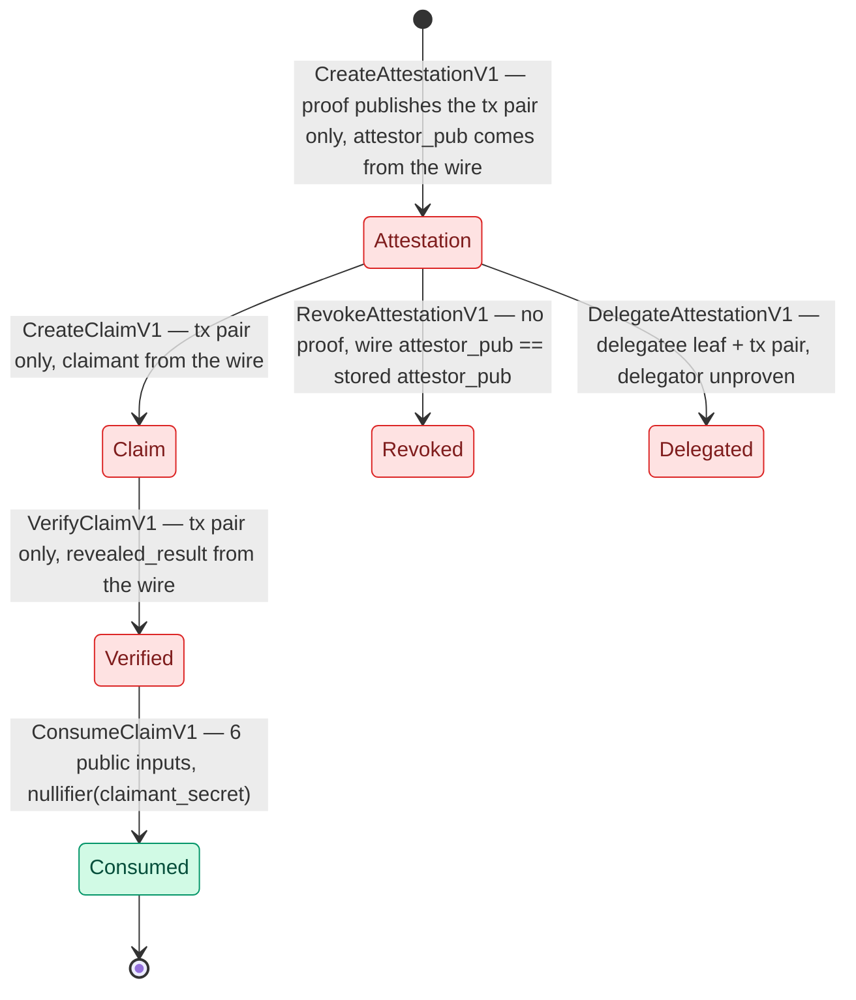

### 4.2 The forgery path needs one secret — the forger's

The brief frames the bug as *replay*. The stronger statement is *forgery*: nothing in the lifecycle before `Consume` requires the attestor's or claimant's secret, so an attestation in a victim's name can be minted, claimed and verified by one party.

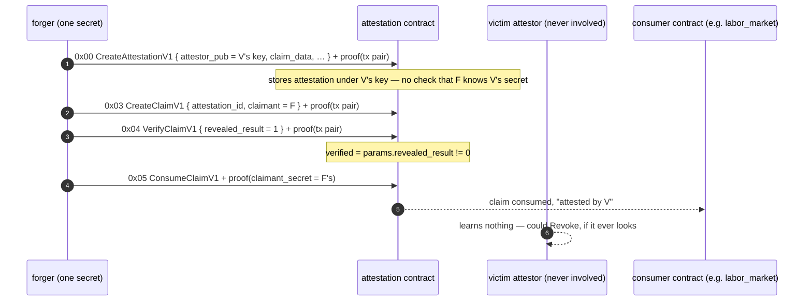

`binding.FORGERY_PATH` lists the four steps with the secret each requires; `secrets_required()` returns `{'forger'}`. 🧪 The register's nearest rows are **OBL‑Z18 FAILS** — *"every `constrain_equal_base` has at least one operand the verifier can see"*, 57 sites across 12 contracts — and **OBL‑Z3 FAILS** on domain separation. Neither names attestation, and the reason is instructive: nine of its ten circuits contain **no `constrain_equal_*` at all** (`data/ocap_circuit_stats.csv`), so a gate that inspects the operands of a circuit's equalities has nothing to inspect. A circuit that constrains nothing is invisible to a checker that looks for weak constraints; the register's `Z18` sweep would need a sibling rule — *every value the host reads from the wire is a `constrain_instance` of some circuit* — to catch it. 🦀 🧪

### 4.3 Is "bind to Identity" the fix?

The brief's remediation would route attestations through an Identity credential. Reading the circuits suggests a shorter path, and one the project has already taken elsewhere: *make the circuit publish what the host checks*. The `subscription` repair recorded under OBL‑C75 (`subscribe.zk` now `constrain_instance`s `derived_id`; the metadata arm publishes it; the host keys on it) is exactly the shape attestation lacks — `CreateAttestationV2` would derive `attestor_pub` from `attester_secret` in‑circuit and publish it, `VerifyClaimV2` would publish `revealed_result` and the predicate inputs it is supposed to evaluate. An Identity binding on top of unproven circuits binds a forgeable attestation to a credential; a proven attestor binding makes the Identity layer optional. The two fixes are not alternatives — but the circuit fix is the one without which the other does nothing. 🦀

**Verdict: confirmed, and the mechanism is weaker than the brief says** — not "a note can be replayed" but "a note can be fabricated, and in addition every proof is replayable by construction because its binding is a constant". [§7.1](#71-the-tx_binding-chain-has-three-of-four-stages) shows that constant is the rule across the codebase, not an attestation quirk. 📖 🦀 🧪

---

## 5. BUG‑03 — stale oracle state masking

> **The claim (HIGH).** In Treasury + Endowment mode the DAO reads an oracle value whose staleness is not checked; a withholding operator can keep an outdated value in force. Remediation: a `min_block_height` guard with a window under five blocks.

### 5.1 The read the brief describes cannot be issued

There is no oracle read in `dao_escrow` — the Book‑era `ResolveDisputeV1 (0x0C)` that consulted one is among the seven retired selectors ([§2.3](#23-what-happened-to-the-seventeen-selectors)). More fundamentally, **no contract can read another contract's state** on this chain. The host import a WASM module uses to open a database, `db_lookup`, decodes the requested `ContractId` and refuses any that is not the caller's own: *"Unauthorized ContractId — cross‑contract access denied"* → `CALLER_ACCESS_DENIED` (`src/runtime/import/db.rs:208–298`). The only way an oracle value reaches a consumer is as a **child call in the same transaction** — `Oracle::PushValueV1`, whose `value` is a `constrain_instance` of `PushValueV2` and is therefore current *by construction* at the height the block is verified. 🦀

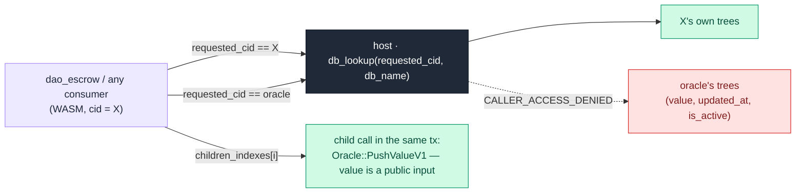

### 5.2 What the oracle actually records

The oracle writes `updated_at = get_verifying_block_height()` on create and on every push (`oracle/src/entrypoint.rs:369–381, 395–397`), keeps `is_active`, and forbids a repeated *value* through a nullifier `H(1, secret, oracle_id, value)` (`DuplicateNullifier`, line 303). There is no sequence number; pushes are last‑write‑wins. So the freshness datum the brief wants (`updated_at`) **exists** — what does not exist is any consumer that reads it, and any path by which one could. `FRESHNESS_SOURCES` in the model lists the four candidates and their status: 🧪

| Source | What it is | Status |
|---|---|---|
| `oracle.updated_at` | block height of last push | written by `PushValueV1`; **no on‑chain reader** |
| `oracle.sequence` | monotone counter | **does not exist** |
| child `Oracle::PushValueV1` in the same tx | `value` is a public input of `PushValueV2` | proof‑bound; current by construction |
| `params.oracle_signature` (`darkbet_exchange`, `insurance_market`) | a field the consumer trusts | **never verified** — *"a consumer that reads a signature field rather than this contract's own record is trusting its caller"* (`doc/src/contract/oracle.md:274–276`) |

The Book's oracle trust table makes the same split (p. 979): *"Data is timely → Check `updated_at` timestamp"* is listed as a **consumer** obligation, beside the admission that *"signature verification is BYPASSED in‑circuit in consuming contracts"* pending a `SchnorrVerify` opcode. 📖

### 5.3 If a consumer could read `updated_at`: the window trade‑off

Suppose the import existed (or the oracle were restructured so that the consumer's child call carried `updated_at` as a public input). The brief's five‑block window is a design number, so the model prices it. A deterministic simulation (`oracle_freshness.simulate`, seed 2) runs 20 000 blocks; an operator pushes every ~10 blocks with geometric jitter but with probability 0.05 per scheduled push goes silent for 40 blocks while the true value moves; a consumer reads every 3 blocks and applies `ReadPolicy(max_age)`.

```python
@dataclass(frozen=True)
class ReadPolicy:
    max_age: int | None = None          # None = today's behaviour: accept any age
    require_active: bool = True
    def accept(self, rec: OracleRecord, height: int) -> bool:
        if self.require_active and not rec.is_active: return False
        if self.max_age is not None and rec.age(height) > self.max_age: return False
        return True

def push(rec, value, height, spent):    # push_value_v1: last-write-wins; nullifier forbids a repeated *value*
    if (value,) in spent: raise ValueError("DuplicateNullifier")
    spent.add((value,))
    return OracleRecord(value, height, True if rec is None else rec.is_active)
```

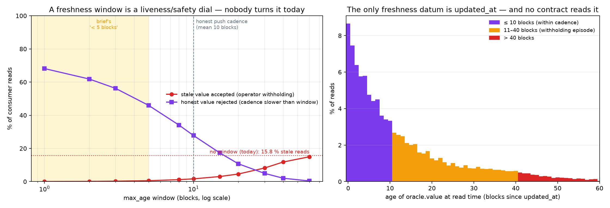

| `max_age` (blocks) | stale reads accepted | honest reads rejected | accept rate |
|---:|---:|---:|---:|
| none (today) | 15.78 % | 0.00 % | 100.00 % |
| 1 | 0.05 % | 68.15 % | 16.11 % |
| 2 | 0.12 % | 61.84 % | 22.50 % |
| 3 | 0.26 % | 56.21 % | 28.26 % |
| **5 (the brief)** | **0.54 %** | **45.95 %** | **38.81 %** |
| 8 | 1.17 % | 34.05 % | 51.34 % |
| 10 | 1.65 % | 27.80 % | 58.07 % |
| 15 | 3.05 % | 17.33 % | 69.94 % |
| 20 | 4.56 % | 10.73 % | 78.05 % |
| 30 | 8.19 % | 4.95 % | 87.46 % |
| 40 | 11.81 % | 2.03 % | 94.00 % |
| 60 | 14.97 % | 0.38 % | 98.81 % |

With a push cadence of ~10 blocks (≈ 20 min at `BLOCK_SECONDS = 120`), a five‑block window rejects **46 %** of honest reads to remove 15 % stale ones; the knee of the curve is nearer 15–20 blocks. A window is also the wrong instrument for a *withholding* operator: `updated_at` says when the last push landed, not whether a newer value was suppressed. The defence that fits the architecture is the one it already has — put the push in the consumer's transaction — plus a sequence number if two pushes in one block must be ordered. 🧪

**Verdict: not applicable to the component, and the remediation mis‑prices its own parameter.** The genuine oracle findings are elsewhere: `oracle_signature` accepted and never verified by two consumers (`oracle.md:274–278`, pending a `SchnorrVerify` opcode), and no sequence number. 📖 🦀 🧪

---

## 6. BUG‑04 — capability aliasing through `manifest.toml`

> **The claim (MEDIUM).** A deployer can publish a `manifest.toml` that labels a dangerous function with a benign capability name; wallets and composers that resolve by name are deceived. Remediation: bind manifest hashes on‑chain.

### 6.1 What a manifest is, and where it goes

Every one of the 32 contracts ships a `manifest.toml` — functions with `code`, `name`, `requires_proof`, optional `capabilities` and `actions`. At deploy the wallet serialises it behind a one‑byte prefix `MANIFEST_MAGIC_BYTE = 0x4D` into `DeployParamsV1.ix` (`src/sdk/src/manifest.rs:996–1010`); the chain stores the bytes **uninterpreted**; the wallet's scanner later pulls them back into its SQLite and the CLI's `ManifestResolver` answers *"what is function `withdraw`?"* by **string match** on `f.name == name` and `c.name == name` (`bin/dww/src/manifest_resolver.rs:24–38`). No hash of the manifest is ever written on chain, and no component compares it with the WASM it describes. 🦀

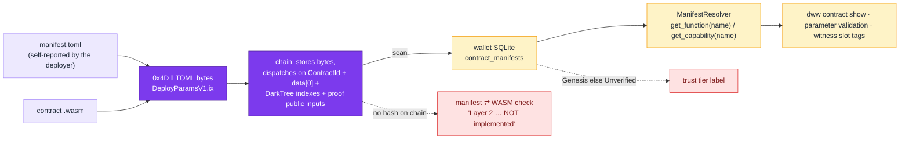

The wallet says so in its own source: *"Layer 2 of the trust model — verifying the manifest against the deployed WASM — is NOT implemented … the module that would have done the check was removed as unreachable code"*, and prints `WASM verification: not implemented` under every `contract show` (`bin/dww/src/dispatch.rs:308–315`). `resolve_show_trust` returns **Genesis** for the nine genesis contracts and **Unverified** for everything else (`dispatch.rs:1195–1225`). The Book's trust‑model table had already set expectations: *WASM Verification — "None (mechanical)"; Attestation — "Social (deferred)"* (p. 6), with a four‑tier ladder *Genesis → SelfDeployed → Attested → Unverified* (p. 889) of which two rungs exist. 📖 🦀

### 6.2 How much surface, and how much of it is typed

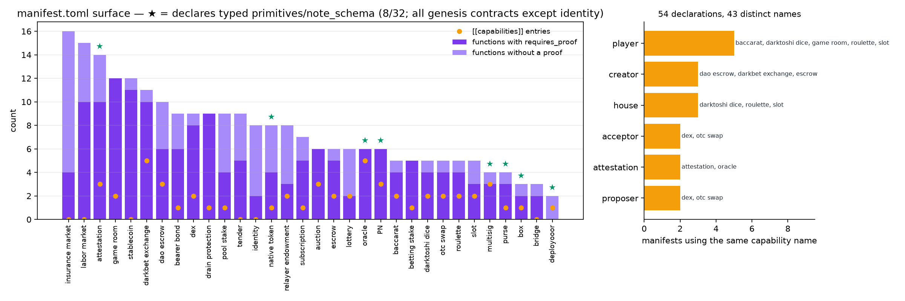

Across the 32 manifests ([`data/manifest_surface.csv`](../../data/manifest_surface.csv)): **242 functions**, 168 of them `requires_proof`; **54 capability declarations** (43 distinct names); 32 declared actions in 9 contracts; **167 circuits** and 158 trees. Only **8 of 32** manifests use the typed capability fields (`primitives`, a closed vocabulary, and `note_schema`) — the genesis set minus `identity` — so for 24 contracts a capability is a bare label. Six names recur across unrelated contracts: `player` ×5, `creator` ×3, `house` ×3, `attestation` ×2, `proposer` ×2, `acceptor` ×2. A resolver keyed on name has nothing to tell them apart. 🧪

```toml
# a relabelled purse — every field well‑formed, every name a lie
[[functions]]
code = 0x02
name = "identity_verification"     # the chain will run Withdraw
requires_proof = true
[[functions]]
code = 0x01
name = "audit_log"                 # the chain will run Deposit
requires_proof = true
```

```python
>>> spoof = Manifest("not_a_purse", (ManifestFunction("identity_verification", 0x02, True, "Withdraw"),
...                                  ManifestFunction("audit_log", 0x01, True, "Deposit")))
>>> for a in alias(spoof, {0x00: "Initialize", 0x01: "Deposit", 0x02: "Withdraw", 0x03: "Balance"}):
...     print(f"'{a.name}' -> 0x{a.code:02x} is really {a.true_name}; layer-2 catches: {a.caught_by_layer2}")
'identity_verification' -> 0x02 is really Withdraw; layer-2 catches: False
'audit_log' -> 0x01 is really Deposit; layer-2 catches: False
```

`caught_by_layer2` is `False` on purpose: the Layer 2 check *as designed* compares exported symbol names and circuit namespaces with the manifest, so it would notice a function that does not exist — and not one that exists under a flattering name. The project's own manifest doc calls this *"sophisticated deception where the WASM exports the claimed function but it doesn't do what the name implies"*. A manifest hash on chain (the brief's remediation) would make the manifest *tamper‑evident after deployment*; it would not make it *true*. 🦀 🧪

### 6.3 What the chain dispatches on

```python
>>> manifest_caps.what_the_chain_dispatches_on()
('ContractId (32 bytes, Poseidon-derived)', 'data[0] selector (u8)',
 'children_indexes / parent_index (DarkTree)', 'ZK proof public inputs from metadata()')
>>> manifest_caps.what_the_manifest_controls()
('display names of functions and capabilities', 'CLI parameter validation',
 'which witness slots the generic prover fills from the note (witness / off_wire tags)',
 'cost-profile baselines', 'trust-tier label text')
```

Nothing in the first tuple is read from the manifest. A parent contract that composes a child checks `contract_id` and `data[0]` against constants compiled into **its own** WASM (`validate_child_contract_id`, and the `0x03` / `0x02` literals in [§2.2](#22-code-era-a-dao-that-composes-exactly-two-things) and [§3.3](#33-the-real-residual-what-the-parent-reads-that-the-proof-never-published)); the manifest cannot redirect a composition. What it *can* do is mislead a human reading `dww contract show`, and — through the `witness` / `off_wire` tags — tell the generic prover which note fields to load, which is a wallet‑side footgun rather than a chain‑side authority. 🦀

**Verdict: partially confirmed, scoped to the wallet.** The brief's mechanism (name resolution) is real and unmitigated — the register's nearest row, **OBL‑C179 OPEN**, has the same root cause from the other side: ten of purse `deposit`'s sixteen manifest parameters are tagged witness‑borne while the decoder reads all sixteen, and *"a checker that reads names cannot tell which"* is wrong — but it is a UX/trust‑display weakness, not a capability bypass; "capability" on this chain is a proof, and proofs are not resolved by name. 📖 🦀 🧪

---

## 7. Cross‑cutting: the `tx_binding` chain, the verification register, two Week 1 corrections

### 7.1 The `tx_binding` chain has three of four stages

Every claim in this write‑up that a proof is "replayable" rests on one fact, so it is traced end to end. The spec is unambiguous (`doc/src/contract/tx-commitment.md` §Verification, lines 99–110): *"For each proof, the node: 1. Reads `tx_nonce` from the proof's public inputs 2. Computes `expected = poseidon_hash(tx.tx_commitment, tx_nonce)` 3. Verifies `expected == tx_binding`."* The Book repeats it (p. 1251). The code implements the circuit half and the metadata half, and stops.

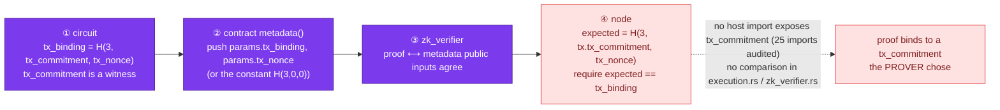

Stage ④ does not exist: none of the 25 host imports in `src/runtime/import/` hands `tx_commitment` to WASM, and neither `zk_verifier.rs` nor `execution.rs` compares the published `tx_binding` with anything derived from the enclosing transaction (`binding.TX_BINDING_CHAIN`, `HOST_IMPORTS`). So stage ① binds a proof to *some* commitment the prover picked, stage ③ checks the proof and the wire agree with each other, and a proof lifted from one transaction into another verifies in both. 🦀 🧪

What the contracts *do* at stage ② sorts them into two camps — and the larger camp has given up on the mechanism altogether:

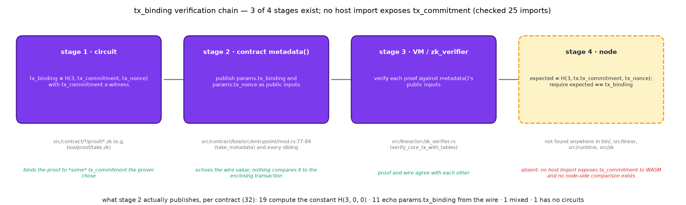

| `metadata()` publishes | n | contracts |
|---|---:|---|
| the **constant** `poseidon_hash(3, 0, 0)` | **19** | attestation, auction, baccarat, bearer_bond, betting_stake, bridge, **dao_escrow**, darkbet_exchange, darktoshi_dice, **escrow**, game_room, **identity**, insurance_market, lottery, otc_swap, pool_stake, relayer_endowment, roulette, slot |
| **echo** of `params.tx_binding` from the wire | 11 | **box**, dex, drain_protection, labor_market, **multisig**, native_token, **oracle**, promissory_note, **purse**, subscription, tender |
| mixed (per arm) | 1 | stablecoin |
| no circuits | 1 | deployooor |

Of the six governance primitives, five echo the wire and one (attestation) publishes the constant; identity, which the brief wants to bind attestations *to*, publishes the constant as well. `dao_escrow`'s `pay_premium_get_metadata` explains the choice in a comment: the constant `(0, 0)` is *"the convention attestation and identity use, and one of the 21 constant bindings the register already records"* (`entrypoint.rs:252–280`). The register's rule for it is **OBL‑C78 FIXED** — the tx pair is never a literal *zero* — which is a well‑formedness fix (a literal `(0, 0)` made the arm's proof unverifiable), not a binding. Until stage ④ exists the echo camp is no safer than the constant camp; it is merely *ready* to be. 🦀

### 7.2 Two corrections to Week 1

* **Week 1 §3.1 and §3.5 over‑stated `tx_binding`.** [Week 1](../week-01/README.md) line 490 says every circuit publishes `tx_binding` *"so that a proof cannot be lifted out of one transaction and replayed in another"*, and line 683 credits `tx_binding` with preventing PN proofs being *"recombined into another"* transaction. Both describe the spec, not the code: with stage ④ absent, the lift is **not** prevented. What *does* prevent PN recombination today is the nullifier set (a spent input cannot be spent again) and the value‑balance check inside one transaction, not `tx_binding`. The Week 1 text is left as written and this note is the erratum.
* **Week 1 Finding 8 is closed upstream.** Finding 8 reported that Box/Purse leaves were `H(5, id, contents‑or‑balance, nonce)` with no owner field. At `d775e37c` the leaves are `H(5, box_id, contents_commit, state_nonce, owner_pub)` (`take.zk:42`, `put.zk:46`) and `H(5, purse_id, balance, state_nonce, owner_pub)` (`deposit.zk:66`), with `owner_pub` derived in‑circuit from `owner_secret`. The Week 1 model (`l1_circuits.py`, whose leaf tuples carry no owner field and whose `leaf_binds_owner` is `False` for all four) is kept as a record of commit `ec914970`; Week 2's `ocap_primitives.py` carries the new formulas, and the test `test_week1_finding_8_is_closed_at_d775e37c` pins the difference. 🧪

### 7.3 Where the four bugs land in the project's own register

The HAZOP‑style verification register (`doc/src/arch/verification-hazop.md`) has **242** rows. The status mix — and the fact that two of the three rows marked **FAILS** describe the class of defect this write‑up kept running into — is a useful calibration of the brief's severities:

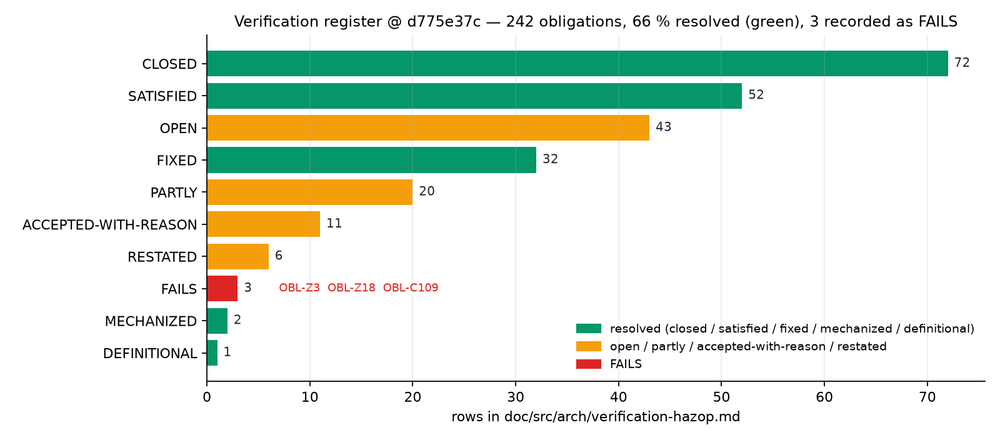

| Brief | Rows this write‑up relied on | Status |
|---|---|---|
| BUG‑01 | OBL‑C171 (parent reads a field the child's proof never published) · OBL‑C151 (Book‑era `governance_active` gate) · OBL‑C152 (public‑vs‑public authorisation) · OBL‑C168 (one‑shot guard scoped to its action) | **OPEN** · CLOSED · FIXED · FIXED |
| BUG‑02 | OBL‑Z18 (every `constrain_equal_base` has a visible operand — attestation's circuits have none to check) · OBL‑Z3 (domain separation by the *right* constant) · OBL‑C75 (host keys state on the id the circuit publishes — the subscription repair) | **FAILS** · **FAILS** · CLOSED |
| BUG‑03 | — (no row; the read cannot be issued) | — |
| BUG‑04 | OBL‑C179 (manifest tags vs decoder; name‑reading checker) | **OPEN** |
| all four | OBL‑C78 (tx pair never a literal zero) · OBL‑Z2 (metadata position‑for‑position) | FIXED · FIXED |

Resolved share across the register is 65.7 % (CLOSED 72 + SATISFIED 52 + FIXED 32 + MECHANIZED 2 + DEFINITIONAL 1 over 242). The register already knows about every defect this write‑up could substantiate except two, which are the additions this research would propose: a row for stage ④ of the `tx_binding` chain, and a sibling of `Z18` stating that every wire field a host reads is a `constrain_instance` of some circuit (which is what attestation fails). 🦀 🧪

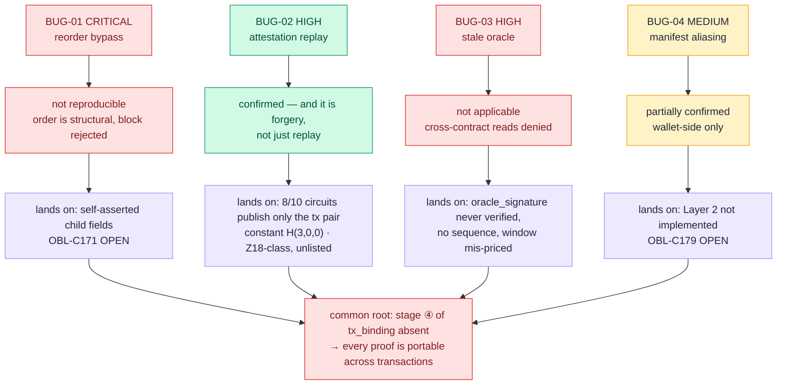

---

## 8. Findings, discrepancies and open questions

Numbered as in Week 1. 1–5 concern BUG‑01, 6–8 BUG‑02, 9–10 BUG‑03, 11 BUG‑04, 12–17 cross‑cutting and documentation.

1. **BUG‑01 is not reproducible against `d775e37c`.** `dao_escrow` composes `PN::TransferV1` and `multisig::FinalizeV1`, not Box or Purse; the Box/Purse paths the brief describes exist only in the Book‑era design (17 selectors, p. 1142–1172) and in `escrow`. 📖 🦀
2. **Call order is a property of the DarkTree, not a degree of freedom.** Leaves are DFS post‑order (`dark_tree.rs:92`), children always precede their parent, the node re‑checks the layout (`zk_verifier.rs:60–95`), and parents address children by slot; swapping siblings fails at the slot check. The "ZKAS compiler dependency enforcement" remediation targets a 32‑opcode circuit language with no notion of calls. 🦀 🧪
3. **A failed canonical call rejects the block, not just the transaction** (`execution.rs:566–574`), after reverting the call's overlay writes (`:415–417`). "Purse transferred, Box never checked" is not a reachable state. 🦀
4. **The real residual is self‑asserted child fields.** `escrow::ClaimV1` binds its Box child by `TakeParams.contents_commit`, which `take.zk` never publishes; any valid Box with the right wire value passes; Purse's plaintext `amount` has the same shape. The crate (`box/model/mod.rs:182–197`) and the register (OBL‑C171 OPEN) both say so. In today's `escrow` the seller's own `claim.zk` carries the authority; in the Book‑era `dao_escrow` the Box child *was* the authority. 🦀 🧪
5. **The Book‑era fail‑open paths are gone and 7 of 17 selectors with them.** `data[0]`‑only child checks (p. 1172) and `governance_active = false ⇒ "Open (any caller)"` (p. 1147) are replaced by `require_governance_child` (`entrypoint.rs:1097–1150`, six distinct error paths); `EnableDrainProtection`, the three capability‑requirement registry selectors, `ResolveDispute`, `SetGovernanceConfig` and `SetGovernanceActive` no longer exist. The Book's "20/20 tests, 2 compiled, 4 source complete" (p. 1163) describes neither state. 📖 🦀
6. **BUG‑02 is confirmed, and is forgery rather than replay.** Eight of attestation's ten circuits publish only `(tx_binding, tx_nonce)`; `VerifyClaimV2` computes `evidence_hash`, `attestation_hash` and `leaf` and constrains none; the host decides `verified` from the wire's `revealed_result` under a comment that credits the circuit. One party with one secret can create, claim and verify an attestation in a victim's name (`FORGERY_PATH`). Only `ConsumeClaimV1` binds its actor. The register's weak‑constraint gate (OBL‑Z18, **FAILS**) does not list attestation because nine of its ten circuits have no `constrain_equal_*` to inspect — a gap in the gate, not a clean bill. 🦀 🧪
7. **Every attestation proof is replayable by construction** because `get_metadata` pushes the constant `H(3, 0, 0)` for all arms (`entrypoint.rs:162–165`); the Book's "Consume claims to prevent replay" (p. 981) is the only working defence. 📖 🦀
8. **"Bind to Identity" is the second fix, not the first.** Identity publishes the same constant binding and the same unproven‑operand pattern; a credential bound to a forgeable attestation changes nothing. The pattern that works is already in the tree — `subscription`'s OBL‑C75 repair (`subscribe.zk:73` publishes `derived_id`). 🦀
9. **BUG‑03's read cannot be issued.** `db_lookup` denies any `ContractId` but the caller's (`db.rs:293–298`); the retired `ResolveDisputeV1` was the only DAO path near an oracle; a same‑tx `PushValueV1` child is current by construction. 🦀
10. **Freshness is a consumer obligation the Book already assigns (p. 979) and no consumer meets;** a 5‑block window at a ~10‑block push cadence rejects 46 % of honest reads (`oracle_freshness.tradeoff`). The oracle has `updated_at`, no sequence number, and two consumers that accept an `oracle_signature` they never verify (`oracle.md:274–278`). 📖 🧪
11. **BUG‑04 is real and wallet‑side.** Manifests are self‑reported, `0x4D`‑prefixed, stored uninterpreted, resolved by string match (`manifest_resolver.rs:24–38`); Layer 2 is *"NOT implemented"* (`dispatch.rs:308–315`); 8/32 manifests typed; six capability names shared across unrelated contracts. The chain dispatches on `ContractId`, `data[0]`, DarkTree indexes and proof public inputs — none of them from the manifest. OBL‑C179 OPEN. 🦀 🧪
12. **Stage ④ of the `tx_binding` chain is absent across the whole codebase** — no host import exposes `tx_commitment`, no node comparison exists — contradicting `tx-commitment.md` §Verification and Book p. 1251. **19 of 32 contracts** publish the constant `H(3, 0, 0)` and 11 echo the wire; neither binds a proof to its transaction. 📖 🦀 🧪
13. **Erratum to Week 1 (lines 490, 683):** `tx_binding` does not today prevent a proof being lifted into another transaction; nullifiers and the in‑tx value balance do that work for PN. 🧪
14. **Week 1 Finding 8 is closed upstream:** Box/Purse leaves now fold `owner_pub` (`take.zk:42`, `put.zk:46`, `deposit.zk:66`). Week 1's `l1_circuits.py` is kept at `ec914970` values deliberately (`LEAF_FORMULAS` in `ocap_primitives.py` carries the new ones). 🦀 🧪
15. **The brief's severities are inverted relative to the register.** The CRITICAL and one HIGH are not reproducible; the other HIGH is confirmed, belongs to a class the project itself marks **FAILS** (OBL‑Z18) and is not listed under it; the MEDIUM is OPEN. Resolved share of the 242‑row register: 65.7 %. 🦀 🧪
16. **Book vs code counts.** Attestation: 13 selectors in the Book (p. 983) vs 14 in code (`0x0D CheckAttestationV1`). `dao_escrow`: 17 vs 10. Oracle+Attestation flow (p. 976) and the trust tables (pp. 6, 979) describe obligations the code assigns to consumers but no consumer implements. 📖
17. **Open.** (a) The forgery path in §4.2 is argued from the circuits and the entrypoint; it has not been run through the test harness against a live node — a cheap follow‑up. (b) Whether stage ④ is planned (a `get_tx_commitment` host import, or node‑side comparison in `zk_verifier.rs`) is not stated anywhere in `doc/`; the register has no row for it, nor for the "host reads only proven fields" rule attestation breaks. (c) The DarkFi comparison deferred from Week 1 remains deferred.

---

## 9. Reproduce

```bash
git clone https://github.com/9lordisgod/DarkWow-Chain-Research
cd DarkWow-Chain-Research
pip install -r code/requirements.txt          # matplotlib only; the models are stdlib
cd code && python -m pytest -q && cd ..       # 158 tests (56 Week 1 + 102 Week 2)
python code/plot_charts.py                    # regenerates charts/ and data/ for both weeks

python3 -m code.darkwow_research.ocap_primitives   # six primitives: circuits, public inputs, who composes whom
python3 -m code.darkwow_research.call_tree         # DarkTree post-order, escrow ClaimV1 and Book-era TreasurySpend traces
python3 -m code.darkwow_research.binding           # attestation authority table, forgery path, tx_binding chain, 19/11/1/1 split
python3 -m code.darkwow_research.oracle_freshness  # staleness vs false-reject table for twelve windows
python3 -m code.darkwow_research.manifest_caps     # manifest totals, typed coverage, alias demo, trust layers
```

Source checkout for every `🦀` citation: `git clone -b linear-master https://github.com/PatrickMockridge/DarkWow && git checkout d775e37c`. Counts were made as follows — selectors and public inputs by reading each `entrypoint.rs` arm against its `proof/*.zk` `constrain_instance` list; the 19/11/1/1 `tx_binding` split by stripping comments from every `entrypoint*.rs` and classifying each `metadata()` arm's source for the tx pair; manifest totals with `tomllib` over `src/contract/*/manifest.toml`; HAZOP statuses by counting the bold status cell of each `| OBL-` row; Book page numbers from `pdftotext -layout` over `sources/The-DarkWow-Book-2026-09-03.pdf` (pages 6, 18, 187, 889, 975–983, 1142–1172, 1251).

---

## 10. References

* **Brief** — *O‑Cap Governance Primitives vs. Monolithic DAOs*, Week 2 section of the research Google Doc (window 2026‑09‑28 → 10‑04; BUG‑01…BUG‑04).
* **The DarkWow Book** (2026‑09‑03 snapshot) — `sources/The-DarkWow-Book-2026-09-03.pdf`: trust model p. 6; DAO escrow pp. 1142–1172; Oracle pp. 975–979; Attestation pp. 981–983; trust tiers p. 889; tx commitment p. 1251.
* **DarkWow source** at `d775e37c` (`linear-master`):
  * `src/contract/dao_escrow/src/entrypoint.rs` (252–280, 907, 1039, 1097–1150, 1708); `src/contract/escrow/src/entrypoint.rs` (442–618); `src/contract/escrow/proof/claim.zk`
  * `src/contract/box/proof/{put,take}.zk`; `src/contract/box/src/entrypoint/mod.rs` (77–84); `src/contract/box/src/model/mod.rs` (182–204); `src/contract/purse/proof/{deposit,withdraw}.zk`
  * `src/contract/attestation/src/entrypoint.rs` (145–355, 438–800, 747–765); `src/contract/attestation/proof/*.zk`
  * `src/contract/oracle/src/entrypoint.rs` (303, 365–400); `src/runtime/import/db.rs` (208–298); `doc/src/contract/oracle.md` (268–280)
  * `src/sdk/src/dark_tree.rs` (92, 152–160, 226, 269); `src/tx/mod.rs` (160–171); `src/linear/src/zk_verifier.rs` (60–95); `src/linear/src/execution.rs` (84–92, 415–417, 527–574); `src/zkas/opcode.rs`
  * `src/sdk/src/manifest.rs` (996–1010); `bin/dww/src/dispatch.rs` (300–318, 1195–1225); `bin/dww/src/manifest_resolver.rs` (24–38); `doc/src/arch/manifest.md` (653)
  * `doc/src/contract/tx-commitment.md` (99–110); `doc/src/arch/verification-hazop.md` (OBL‑Z2, Z3, Z18, C75, C78, C151, C152, C168, C171, C179)
  * `src/contract/subscription/proof/subscribe.zk` (61–73); `src/contract/identity/src/entrypoint.rs` (117–121)
* **Week 1** — [`weeks/week-01/README.md`](../week-01/README.md) (§3.1 line 490, §3.5 line 683, Finding 8) and `code/darkwow_research/l1_circuits.py`.
* Models and tests for this week: `code/darkwow_research/{ocap_primitives,call_tree,binding,oracle_freshness,manifest_caps}.py`, `code/tests/test_*.py`; charts in [`charts/`](charts/); tables in [`data/`](../../data/).
